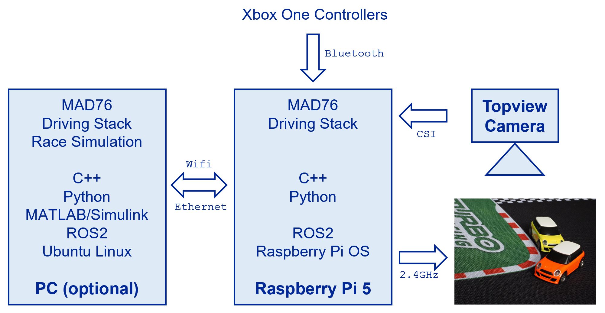

author: Frank Tränkle[^1]  
Hochschule Heilbronn, Germany
bibliography: ../lib/bib.bib
csl: ../lib/ieee.csl
link-citations: true
reference-section-title: References
title: Mini-Auto-Drive MAD76

MAD76 Features
==============

-   Autonomous Driving in 1:76 scale

-   Multi-player robot car racing

-   Race against AI cars using Xbox controllers

-   Program your own AI

-   100 x 50cm tracks

-   Fits in a backpack for easy transport

-   @home @school @university @automotive partners @open source
    @Hochschule Heilbronn @Automotive Systems Engineering

-   \#Computer Vision \#Motion Planning \#Motion Control \#Deep Neural
    Networks \#Reinforcement Learning \#Raspberry Pi Programmming \#C++
    Coding \#Python Coding \#MATLAB/Simulink Simulation \#ROS2

-   <https://www.youtube.com/@ft7894>

MAD76 Kit
=========

-   Turboracing 1:76 RC cars (<https://www.turboracing.net>)

-   Raspberry Pi Global Shutter Camera is mounted in topview on tripod

-   Raspberry Pi 5 runs Raspberry Pi OS (Debian Linux)

-   MAD76 Driving Stack is implemented as software components in
    middleware ROS2 (<https://docs.ros.org/en/iron/index.html>)

    -   Computer Vision reads in frames from topview camera and detects
        cars by ArUco markers

    -   Multi-Object Tracking computes the cars’ velocities

    -   Motion Planning computes optimal trajectories

    -   Motion Control controls the cars on the trajectories

    -   Optional race simulation

-   MAD76 Driving Stack is programmed in C++ and Python

-   MAD76 Driving Stack may run in a distributed computer environment
    (Raspberry Pi and Linux-PCs)

-   Optional Linux-PCs are for race simulation, programming,
    MATLAB/Simulink simulation, deep neural network training

-   MAD76 is open source

-   Contributions are greatly welcome

-   User Manuals

    -   [Installation](doc/install/install.md)

    -   [Computer Vision Configuration](doc/vision/vision.md)

[^1]: frank.traenkle@hs-heilbronn.de
