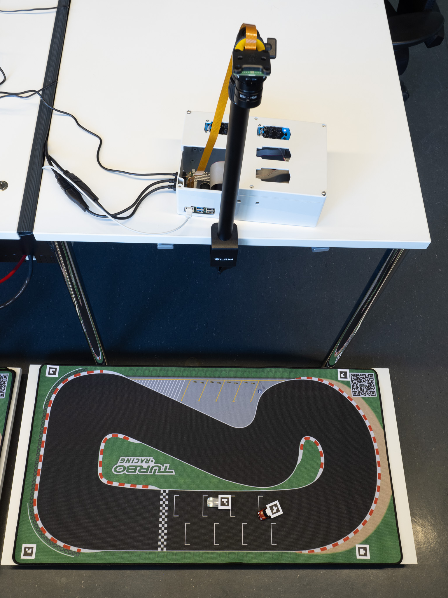

author: Frank Tränkle[^1]  
Hochschule Heilbronn, Germany
bibliography: ../lib/bib.bib
csl: ../lib/ieee.csl
link-citations: true
reference-section-title: References
title: Mini-Auto-Drive MAD76

MAD76 Features
==============

-   Autonomous Driving in 1:76 scale

-   Multi-player robot car racing

-   Race against AI cars using Xbox controllers

-   Program your own AI

-   100 x 50cm tracks

-   Fits in a backpack for easy transport

-   @home @school @university @automotive partners @open source
    @Hochschule Heilbronn @Automotive Systems Engineering

-   \#Computer Vision \#Motion Planning \#Motion Control \#Deep Neural
    Networks \#Reinforcement Learning \#Raspberry Pi Programmming \#C++
    Coding \#Python Coding \#MATLAB/Simulink Simulation \#ROS2

-   <https://www.youtube.com/@ft7894>

MAD76 Kit
=========

-   Turboracing 1:76 RC cars (<https://www.turboracing.net>)

-   Raspberry Pi Global Shutter Camera is mounted in topview on tripod

-   Raspberry Pi 5 runs Raspberry Pi OS (Debian Linux)

-   MAD76 Driving Stack is implemented as software components in
    middleware ROS2 (<https://docs.ros.org/en/jazzy/index.html>)

-   MAD76 Driving Stack consists of the following software components:

    -   Computer Vision reads in frames from topview camera and detects
        cars by ArUco markers

    -   Multi-Object Tracking computes the cars’ velocities

    -   Motion Planning computes optimal trajectories

    -   Motion Control controls the cars on the trajectories

    -   Optional race simulation

-   MAD76 Driving Stack is programmed in C++, Python,

-   MAD76 Driving Stack may run in a distributed computer environment
    (Raspberry Pi and Linux-PCs)

-   Optional Linux-PCs are for race simulation, programming,
    MATLAB/Simulink simulation, deep neural network training

-   MAD76 is open source

-   Contributions are greatly welcome

-   [Installation Guide](doc/install/install.md)
    ([install.pdf](doc/install/install.pdf))

MAD76 Academy
=============

MAD76 Academy offers a variety of learning lessons to get started with
your MAD76 kit. To configure and start MAD76 car racing without any
programming efforts, please follow modules B and C.

-   [A. Linux Basics](doc/teachlinux/teachlinux.md)
    ([teachlinux.pdf](doc/teachlinux/teachlinux.pdf))

-   [B. Adjust MAD76](doc/teachadjust/teachadjust.md)
    ([teachadjust.pdf](doc/teachadjust/teachadjust.pdf))

-   [C. Start Car Race](doc/teachrace/teachrace.md)
    ([teachrace.pdf](doc/teachrace/teachrace.pdf))

-   [D. Python Basics](doc/teachpython/teachpython.md)
    ([teachpython.pdf](doc/teachpython/teachpython.pdf))

-   [E. MAD76 I/O Programming](doc/teachmad76io/teachmad76io.md)
    ([teachmad76io.pdf](doc/teachmad76io/teachmad76io.pdf))

-   [F. ROS2 Coding for MAD76](doc/teachros/teachros.md)
    ([teachros.pdf](doc/teachros/teachros.pdf))

-   [G. MAD76 SQL Database](doc/teachsql/teachsql.md)
    ([teachsql.pdf](doc/teachsql/teachsql.pdf))

-   [H. Model-Based Software Engineering with
    MATLAB/Simulink](doc/teachmatlab/teachmatlab.md)
    ([teachmatlab.pdf](doc/teachmatlab/teachmatlab.pdf))

You may further start a Bachelor- or Master-degree study program at
[Hochschule
Heilbronn](https://www.hs-heilbronn.de/en/automotive-systems-engineering)
to deepen your knowledge in

-   autonomous car racing with MAD76

-   autonomous systems, in general

-   automotive systems engineering

-   robotics

-   control theory

-   artificial intelligence

-   embedded software engineering

and get ready for a career in the automotive or robotics industry.

[^1]: frank.traenkle@hs-heilbronn.de
