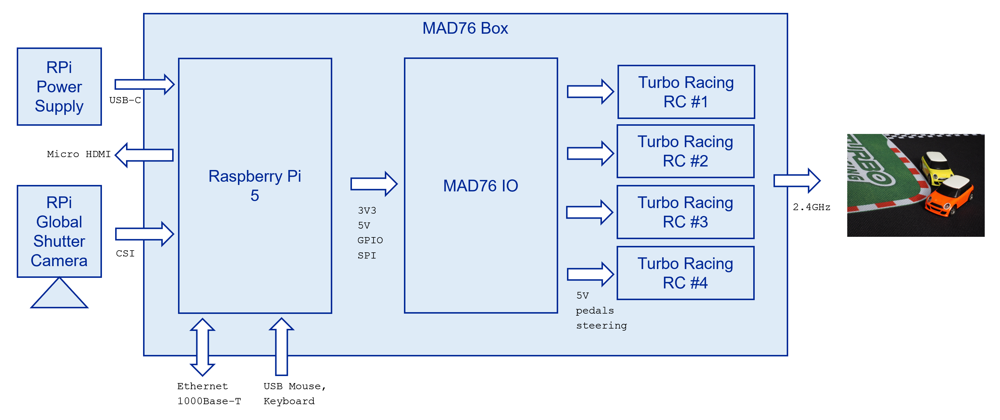
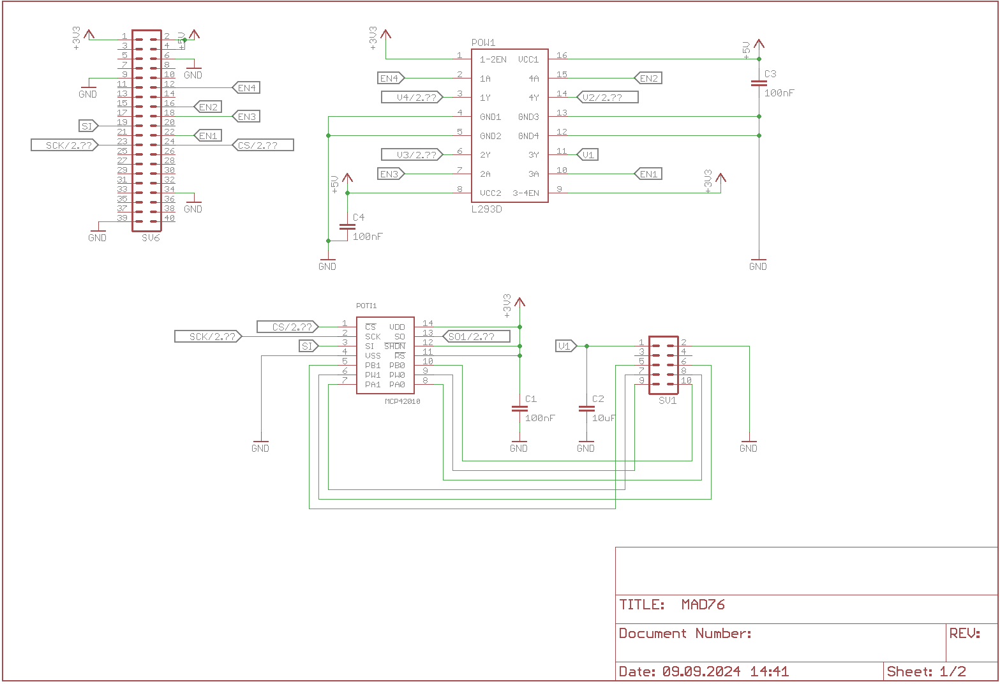
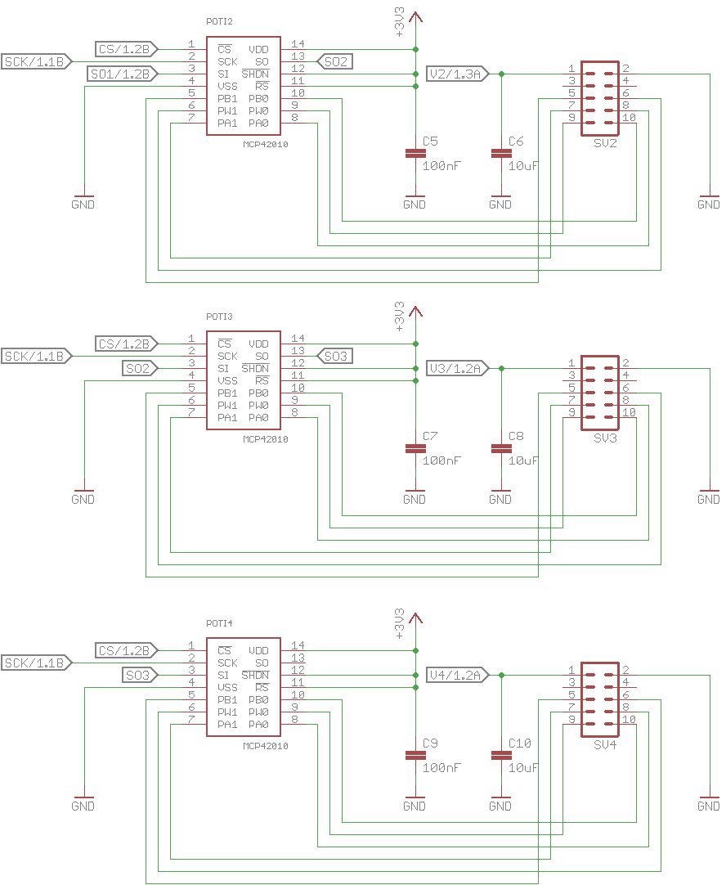
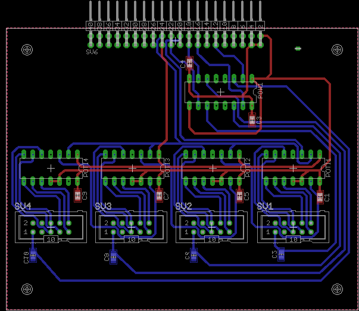
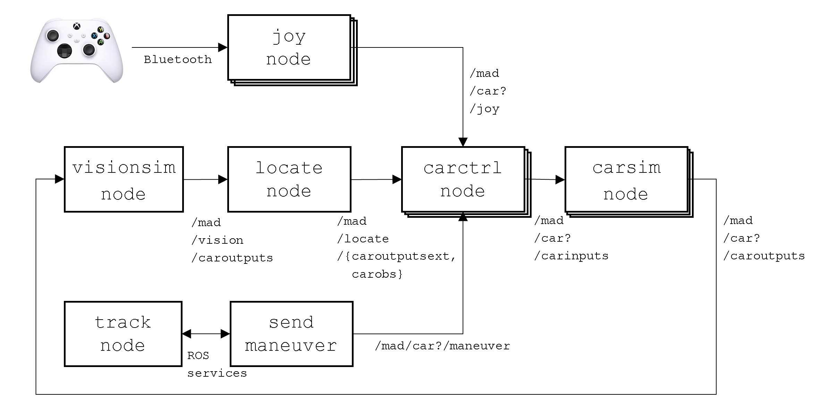

author: Frank Tränkle[^1]  
Hochschule Heilbronn, Germany
bibliography: ../lib/bib.bib
csl: ../lib/ieee.csl
link-citations: true
reference-section-title: References
title: MAD76 Installation

Installation Overview
=====================

<figure>
<figcaption>MAD76 System Architecture</figcaption>
</figure>

The installation steps are:

-   Build the MAD76 Box including the MAD76 IO PCB (see
    Section <a href="#mad76-box" data-reference-type="ref" data-reference="mad76-box">2</a>)

-   Install Raspberry Pi OS, drivers, and ROS2 (see
    Section <a href="#raspberry-pi-installation" data-reference-type="ref" data-reference="raspberry-pi-installation">3</a>)

-   Optionally install ROS2 on optional Linux-PC for distributed
    computing and software-in-the-loop (SiL) simulation (see
    Section <a href="#linux-pc-installation" data-reference-type="ref" data-reference="linux-pc-installation">4</a>)

-   Install MAD76 Driving Stack (see
    Section <a href="#mad76-driving-stack" data-reference-type="ref" data-reference="mad76-driving-stack">5</a>)

MAD76 Box
=========

The MAD76 Box is a self-built housing for the MAD76 electronics
containing

-   Raspberry Pi (RPi)

-   MAD76 IO: self-built PCB electronics for coupling RPi to remote
    controllers (RC) for the Turbo Racing cars

-   Up to 4 RC cars are supported

This section first lists the bill of materials (BOM) for the MAD76 Box.
Then the MAD76 IO is described in more detail.

Bill of Materials (BOM)
-----------------------

### Raspberry Pi and Camera

|     | Description                                                        | Part Id          | Order Link                                                                                                  |
|----:|:-------------------------------------------------------------------|:-----------------|:------------------------------------------------------------------------------------------------------------|
|    1| Raspberry PI 5 B 8GB Black Bundle                                  | RPI5 BBDL 8GB    | <https://www.reichelt.de/das-raspberry-pi-5-b-8gb-black-bundle-rpi5-bbdl-8gb-p362348.html>                  |
|    1| microSD-Card 128 GB                                                |                  | <https://www.rasppishop.de/Sandisk-microSDHC-UHS-I-128GB-Class10-mit-Raspberry-Pi-OS>                       |
|    1| Raspberry Pi Active Cooler                                         | RASP ACTIVE COOL | <https://www.reichelt.de/raspberry-pi-luefter-fuer-raspberry-pi-5-rasp-active-cool-p360116.html>            |
|    1| Raspberry Pi Global Shutter Camera, 1.6MP, C/CS mount              | RASP CAM GS CS   | <https://www.reichelt.de/raspberry-pi-kamera-1-6mp-shutter-c-cs-fassung-rasp-cam-gs-cs-p345205.html>        |
|    1| Raspberry Pi Lens, CS mount, 6mm wideangle                         | RPIZ CAM 6MM WW  | <https://www.reichelt.de/raspberry-pi-objektiv-fuer-cs-fassung-6mm-weitwinkel-rpiz-cam-6mm-ww-p276922.html> |
|    1| AZDelivery Flex Cable 50cm, compatible to Raspberry Pi Zero Camera |                  | <https://www.amazon.de/AZDelivery-Flexkabel-Raspberry-Zero-Display/dp/B07SQ3HKNF>                           |
|    1| Joby GorillaPod 3K Kit Tripod                                      |                  | <https://www.foto-erhardt.de/stative/joby-gorillapod/joby-gorillapod-3k-kit-black-charcoal.html>            |

### MAD76 IO

|     | Description                              | Part Id                                                | Order Link                                                                                          |
|----:|:-----------------------------------------|:-------------------------------------------------------|:----------------------------------------------------------------------------------------------------|
|    1| Platine, Epoxyd, doppelseitig, 300x200mm | EP2CU 300X200                                          | <https://www.reichelt.de/de/de/shop/produkt/platine_epoxyd_doppelseitig_300_x_200_mm-7404>          |
|    4| MCP42010 10kOhm DIL-14                   | MCP 42010-I/P                                          | <https://www.reichelt.de/digitalpoti-2-kanal-256-schritte-10-kohm-dil-14-mcp-42010-i-p-p90112.html> |
|    1| L293B 1A DIP-16                          | L 293 B                                                | <https://www.reichelt.de/push-pull-4-kanal-treiber-1a-dip-16-l-293-b-p9660.html>                    |
|    4| 14-poliger DIL-Socket                    | GS 14P                                                 | <https://www.reichelt.de/ic-sockel-14-polig-superflach-gedreht-vergold--gs-14p-p8207.html>          |
|    1| 16-poliger DIL-Socket                    | GS 16P                                                 | <https://www.reichelt.de/ic-sockel-16-polig-superflach-gedreht-vergold--gs-16p-p8209.html>          |
|    4| Wannenstecker, 10-polig, gerade          | WSL 10G                                                | <https://www.reichelt.de/wannenstecker-10-polig-gerade-wsl-10g-p22816.html>                         |
|    1| Wannenstecker, 40-polig, gewinkelt       | WSL 40W                                                | <https://www.reichelt.de/wannenstecker-40-polig-gewinkelt-wsl-40w-p22836.html>                      |
|    6| SMD-Kondensator 100nF                    | KEM X7R0805 100N or X7R-G0805 100N or WAL 0805B104K500 | <https://www.reichelt.de/de/de/shop/produkt/vielschicht-kerko_100nf_50v_125_c-207073>               |
|    4| SMD-Kondensator 10uF                     | X5R-G0805 10/16 or KEM 0805 10U-2                      | <https://www.reichelt.de/de/de/shop/produkt/smd-vielschichtkondensator_g0805_-_10_f_16v-89734>      |

### Housing

|     | Description                                                                                                             | Part Id                        | Order Link                                                                                                                                                                                       |
|----:|:------------------------------------------------------------------------------------------------------------------------|:-------------------------------|:-------------------------------------------------------------------------------------------------------------------------------------------------------------------------------------------------|
|    1| Industriegehäuse, 250x160x90mm, IP65, lichtgrau                                                                         | 5U340000                       | <https://www.reichelt.de/industriegehaeuse-250-x-160-x-90-mm-ip65-lichtgrau-5u340000-p324394.html>                                                                                               |
|    1| 40-poliges Flachbandkabel 30cm                                                                                          | RPI GPIO40 300                 | <https://www.reichelt.de/raspberry-pi-gpio-kabel-40-pin-30cm-grau-rpi-gpio40-300-p293579.html>                                                                                                   |
|    4| Pfostenverbinder 2,54mm 2x5 (Flachbandkabel)                                                                            | BKL 10120668                   | <https://www.reichelt.de/de/de/shop/produkt/pfostenverbinder_2_54mm_2x5-262790>                                                                                                                  |
|    1| sourcing map 20Stk. M2,5x8mm+5mm Stecker Buchse Messing PCB Motherboard Abstandhalter Ständer                           |                                | <https://www.amazon.de/gp/product/B08G1TP68G>                                                                                                                                                    |
|    1| 300 Stück M2.5 Schrauben Set M2.5 Hex Flach-Knopf Schraube Set, A2 Edelstahl Innensechskantschrauben Schraubensortiment |                                | <https://www.amazon.de/gp/product/B08B648WWQ>                                                                                                                                                    |
|    8| JST-Buchsengehäuse, 1x3-polig                                                                                           | JST PH3P BU or 571-440129-3    | <https://www.reichelt.de/jst-buchsengehaeuse-1x3-polig-ph-jst-ph3p-bu-p185042.html> <https://www.mouser.de/ProductDetail/571-440129-3>                                                           |
|   24| JST-Crimpkontakt, Buchse or 2.0mm, Crimp Contact Cut Strip of 100                                                       | JST PH CKS or 571-1735801-1-CT | <https://www.reichelt.de/de/de/shop/produkt/jst_-_crimpkontakt_buchse_-_ph-185072> <https://www.mouser.de/ProductDetail/TE-Connectivity-AMP/1735801-1-Cut-Strip?qs=oXydCMRm13w8Ga1ULORh6A%3D%3D> |

### Turbo Racing Cars

|        | Description                                                          | Part Id | Order Link                                                                                                                                  |
|-------:|:---------------------------------------------------------------------|:--------|:--------------------------------------------------------------------------------------------------------------------------------------------|
|  1 to 4| Turbo Racing 1:76 Mini Cooper with RC <https://www.turboracing.net/> |         | <https://www.rcfox.de/TB-TR01-Turbo-Racing-1/76-Micro-Mini-Cooper> <https://de.aliexpress.com/item/1005001936818767.html>                   |
|       1| Turbo Racing Mat Track 50x95cm                                       |         | <https://www.rcfox.de/TB-760101-Turbo-Racing-Race-Strecke-fuer-Micro-Rally-50x95-cm> <https://de.aliexpress.com/item/1005006267808509.html> |

MAD76 IO
--------

-   MAD76 IO is the bridge from RPi to the Turbo Racing RCs.

-   MAD76 IO controls up to 4 cars.

-   MAD76 IO substitutes and emulates the two potentiometers for
    throttle/braking and steering by digital potis (MCP42010) for each
    car.

-   MAD76 further provides the power supply of 5V for the RCs.

-   The power supply is controlled individually for each RC by an L293B.

-   The RPi controls the digital potis via SPI.

-   The RPi controls the L293B via GPIO.

-   The MAD76 IO is connected to the RPi via a standard RPi 40-pin GPIO
    cable.

-   The MAD76 IO is connected to the RCs via 8-pin flat ribbon cables.

<figure>
<figcaption>MAD76 IO Schematics Page 1 (Eagle schematics <a href="../../pcb/MAD76.sch">../../pcb/MAD76.sch</a>)</figcaption>
</figure>

<figure>
<figcaption>MAD76 IO Schematics Page 2 (Eagle schematics <a href="../../pcb/MAD76.sch">../../pcb/MAD76.sch</a>)</figcaption>
</figure>

<figure>
<figcaption>MAD76 IO Board Layout (Eagle layout <a href="../../pcb/MAD76.brd">../../pcb/MAD76.brd</a>)</figcaption>
</figure>

Raspberry Pi Installation
=========================

Raspberry Pi OS
---------------

-   Download and start installer \[[1](#ref-raspberrypi-sw)\]

    -   Rasberry Pi OS with desktop (Debian 12 Bookworm 64-bit)

    -   Configure `<username>`

    -   Configure `<hostname>`

    -   Configure WiFi

    -   Enable SSH

-   Login: `ssh <username>@<hostname>`

-   Update Debian

        sudo apt-get update
        sudo apt-get dist-upgrade
        # reboot in case of kernel/firmware updates
        sudo shutdown -r 0 

Raspberry Pi Configuration
--------------------------

-   Enable SPI

    -   `sudo raspi-config`

    -   Goto menu `3 Interface Options`

    -   Select `I4 SPI`

VNC Server
----------

VNC Server allows you to remotely connect to the Raspberry Pi from your
development PC, either Linux, Windows or MacOS.

-   Remove RealVNC

        sudo apt-get purge realvnc-vnc-server

-   Install VNC server

        sudo apt-get install tigervnc-standalone-server
        sudo apt-get install tigervnc-xorg-extension

-   Start VNC server

        vncserver -localhost no -geometry 2550x1350 -depth 24

-   Connect to VNC server from your VNC client: `<hostname>:1`

-   TightVNC on Windows or Remmina on Linux are popular VNC clients.

WiringPi
--------

-   Install WiringPi for GPIO access

        cd
        mkdir src
        cd src
        git clone https://github.com/WiringPi/WiringPi.git
        cd WiringPi
        ./build

ROS2
----

ROS2 is the middleware for the MAD76 software stack.

-   ROS2 Jazzy Jalisco is required. No other ROS2 distribution is
    supported because of compatibility to both Debian Bookworm and
    MATLAB/Simulink R2025a.

-   Building ROS2 Jazzy Jalisco from source
    \[[2](#ref-ros-buildonlinux)\],
    \[[3](#ref-ros-installubuntusource)\]

        mkdir -p ~/src/ros2_jazzy/src
        cd ~/src/ros2_jazzy

        locale  # check for UTF-8

        sudo apt-get install \
          build-essential \
          cmake \
          git \
          python3-colcon-bash \
          python3-pip \
          vcstool \
          wget

        sudo apt-get install python3-lark python3-netifaces
        sudo apt-get install python3-flake8-blind-except python3-flake8-builtins python3-flake8-class-newline python3-flake8-comprehensions    python3-flake8-deprecated    python3-flake8-import-order python3-flake8-quotes python3-pytest-repeat python3-pytest-rerunfailures
        sudo apt-get install python3-rosdep2 python3-vcstools
        sudo apt-get install python3-opencv python3-scipy python3-matplotlib
        sudo apt-get install libbullet-dev libboost-dev
        sudo apt-get install libasio-dev libtinyxml2-dev
        sudo apt-get install qtbase5-dev qtbase5-dev-tools
        sudo apt-get install libacl1-dev libcap-dev libssl-dev libxaw7-dev libogre-1.12-dev libeigen3-dev 
        sudo apt-get install libopencv-dev
        sudo apt-get install liblttng-ust-dev
        sudo apt-get install libboost-python-dev libboost-system-dev libboost-log-dev libgtest-dev libjsoncpp-dev

        wget https://raw.githubusercontent.com/ros2/ros2/jazzy/ros2.repos
        vcs import src < ros2.repos

        rosdep update
        rosdep install --from-paths src --ignore-src --rosdistro jazzy -y --skip-keys "rti-connext-dds-6.0.1 python3-vcstool"

        touch src/eclipse-cyclonedds/COLCON_IGNORE
        touch src/eclipse-iceoryx/COLCON_IGNORE
        touch src/gazebo-release/COLCON_IGNORE
        touch src/ros-visualization/COLCON_IGNORE
        touch src/ros2/rviz/COLCON_IGNORE
        touch src/ros2/rmw_connextdds/COLCON_IGNORE
        touch src/ros2/rmw_cyclonedds/COLCON_IGNORE

        colcon build --symlink-install --cmake-args -DCMAKE_BUILD_TYPE=Release

-   Install ROS2 packages for camera, diagnostics, and Xbox controller

        sudo apt-get install libcamera-dev
        source ~/src/ros2_jazzy/install/setup.bash
        mkdir -p /src/ros_ws/src
        cd ~/src/ros_ws/src
        git clone https://github.com/ros/diagnostics.git -b ros2-jazzy  
        git clone https://github.com/ros-perception/vision_opencv.git -b rolling
        git clone https://github.com/christianrauch/camera_ros -b main
        git clone https://github.com/ros-drivers/joystick_drivers -b ros2
        touch joystick_drivers/ps3joy/COLCON_IGNORE
        touch joystick_drivers/spacenav/COLCON_IGNORE
        touch joystick_drivers/wiimote/COLCON_IGNORE
        touch joystick_drivers/wiimote_msgs/COLCON_IGNORE
        cd ..
        colcon build --symlink-install --cmake-args -DCMAKE_BUILD_TYPE=Release  

Update ROS2
-----------

If you want to update ROS2 later on, you can do the following.

-   Update ROS2 distribution

        cd ~/src/ros2_jazzy
        vcs custom --args remote update
        vcs import src < ros2.repos
        vcs pull src
        colcon build --symlink-install --cmake-args -DCMAKE_BUILD_TYPE=Release

-   Update ROS2 packages for camera and diagnostics

        cd ~/src/ros_ws/src
        cd diagnostics
        git pull
        cd ../vision_opencv
        git pull
        cd ../camera_ros
        git pull
        cd ../joystick_drivers
        git pull
        cd ../..
        source ~/src/ros2_jazzy/install/setup.bash
        colcon build --symlink-install --cmake-args -DCMAKE_BUILD_TYPE=Release

Xbox One Controllers
--------------------

Optionally, Xbox One controllers can be used to manually control the
MAD76 cars in car racing mode.

-   Enable Bluetooth Low Energy (BLE) privacy, so that Xbox One
    controllers can be paired to Raspberry Pi

    -   Add line `Privacy=device` to the `[General]` section of
        `/etc/bluetooth/main.conf` according to
        <https://www.reddit.com/r/linux_gaming/comments/js0trh/comment/gddwyjk/>

-   Follow the instructions on
    <https://pimylifeup.com/xbox-controllers-raspberry-pi/>

Linux-PC Installation
=====================

Next to the Raspberry Pi installation, MAD76 may be further installed
optionally on a Linux PC. The Linux PC allows for more efficient MAD76
software development and debugging. Furthermore, MAD76 may be run in
Software-in-the-Loop (SiL) simulation mode on the Linux PC.
MATLAB/Simulink may be applied for model-based software engineering of
MAD76. For controlling the real MAD76 system, The MAD76 software stack
may be run on a distributed ROS2 environment including the Raspberry Pi
and the Linux PC.

-   Install an Ubuntu Desktop version that supports ROS2 Jazzy Jalisco,
    such as Ubuntu Noble Numbat 24.04
    \[[4](#ref-ubuntu-alternativedownloads)\]. ROS2 Jazzy Jalisco (and
    no other ROS2 version) is required, otherwise distributed computing
    with PC and Raspberry Pi will not work.

-   However, if you only want to run MAD76 in Software-in-the-Loop (SiL)
    simulation mode only, you may use other ROS2 and Linux
    distributions.

-   Install ROS2 Jazzy Jalisco binary (deb) packages according to
    \[[5](#ref-ros-installubuntudeb)\]. Make sure to install the
    following ROS2 packages:

        sudo apt-get install ros-dev-tools ros-jazzy-desktop ros-jazzy-diagnostic-updater

MAD76 Driving Stack
===================

Software Architecture
---------------------

<figure>
<figcaption>ROS2 nodes of MAD76 Driving Stack</figcaption>
</figure>

| ROS2 Node      | Description                                                        |
|:---------------|:-------------------------------------------------------------------|
| `camera_node`  | Rasberry Pi camera driver                                          |
| `vision_node`  | computer vision                                                    |
| `locate_node`  | multi-object tracking                                              |
| `carctrl_node` | motion planning and control for each individual car                |
| `rc_node`      | remote control signals output to $2.4\mathrm{GHz}$ channel via SPI |
| `track_node`   | track map                                                          |
| `joy_node`     | optional node for manual control via joystick                      |

| ROS2 Topic                  | ROS2 Message Type                   | Description                                      |
|:----------------------------|:------------------------------------|:-------------------------------------------------|
| `/mad/camera/image_raw`     | `sensor_msgs::msg::Image`           | camera frames with sampling time $25\mathrm{ms}$ |
| `/mad/camera/camera_info`   | `sensor_msgs::msg::CameraInfo`      | camera calibration info                          |
| `/mad/vision/caroutputs`    | `mbmadmsgs::msg::CarOutputsList`    | list of car poses                                |
| `/mad/locate/caroutputsext` | `mbmadmsgs::msg::CarOutputsExtList` | list of car poses including velocities           |
| `/mad/car?/carinputs`       | `mbmadmsgs::msg::CarInputs`         | control signals for each individual car          |
| `/mad/car?/maneuver`        | `mbmadmsgs::msg::DriveManeuver`     | maneuvers for path following and parking         |
| `/mad/car?/joy`             | `sensor_msgs::msg::Joy`             | standard ROS2 joystick messages                  |

Build MAD76
-----------

-   MAD76 can be built and run on Raspberry Pi and on Ubuntu Linux
    computers

-   ROS2 nodes can run distributedly on multiple computers

-   ROS2 nodes `camera_node` and `rc_node` must run on the Raspberry Pi
    for interfacing with the camera and Turboracing remote controllers

-   All other nodes can run on other computers

-   ROS2 supports this distributed computing transparently when setting
    a common ROS domain ID

-   For running MAD76 in Software-in-the-Loop (SiL) simulation mode (see
    Section <a href="#software-in-the-loop-simulation" data-reference-type="ref" data-reference="software-in-the-loop-simulation">5.3</a>),
    a build of MAD76 on an Ubuntu Linux-PC is sufficient because SiL
    mode does not do any input / output, except for optional joystick
    control

-   Clone Git repository and build MAD76 workspace

        export RMW_IMPLEMENTATION=rmw_fastrtps_cpp
        export ROS_DOMAIN_ID=221
        source ~/src/ros_ws/install/setup.bash # on Raspberry Pi
        #source /opt/ros/iron/install/setup.bash # on Ubuntu Linux-PC
        cd ~/src
        git clone https://<token>@github.com/modbas/mad76
        cd mad76/mad_ws
        colcon build --symlink-install --cmake-args -DCMAKE_BUILD_TYPE=Release

    For building on Raspberry Pi, the `colcon build` command must be
    extended by `–parallel-workers 2` to avoid out-of-memory problems

        colcon build --parallel-workers 2 --symlink-install --cmake-args -DCMAKE_BUILD_TYPE=Release

-   Add security limits

        sudo addgroup mad
        sudo adduser <username> mad # where <username> is your username
        sudo -i
        echo "@mad		 -	 rtprio		 98" >> /etc/security/limits.conf
        echo "@mad		 -	 memlock	 unlimited" >> /etc/security/limits.conf
        shutdown -r 0 # reboot

-   Add the following lines to the end of `~/.bashrc` for automatic
    setup

        export RMW_IMPLEMENTATION=rmw_fastrtps_cpp
        export ROS_DOMAIN_ID=221
        source ~/src/mad76/mad_ws/install/setup.bash

Software-in-the-Loop Simulation
-------------------------------

<figure>
<figcaption>ROS2 nodes in SiL simulation mode</figcaption>
</figure>

-   In order to test your MAD76 installation, you may run MAD76 in
    software-in-the-loop (SiL) simulation mode

    -   The real cars, the camera, and the ROS2 nodes `camera_node`,
        `vision_node` and `rc_node` for computer vision and RC output
        are replaced by simulation models

    -   The MAD76 Driving Stack runs in the loop with vehicle dynamics
        simulation models

    -   Full operation of the driving stack is supported in SiL
        simulation mode

-   Open a new terminal and start MAD76 in SiL mode

        ros2 launch mbmad madpisim.launch

-   Open a further terminal and send a maneuver to car 0 (yellow car)

        ros2 run mbmadcar send_maneuver.py 0 0.3 0.25

    -   First argument is the car identifier (0 for yellow car, 1 for
        orange car)

    -   Second argument is the car reference speed in $\frac{m}{s}$

    -   Third argument is the lateral reference position (0 for right
        curb, 0.25 for right lane, 0.5 for center line, 0.75 for left
        lane, 1 for left curb)

-   Stop `send_maneuver.py` by hitting `Ctrl+c` and send maneuver to car
    1 (orange car)

        ros2 run mbmadcar send_maneuver.py 1 0.2 0.25

-   The maximum speed of each car is $0.5 \frac{m}{s}$

-   You may stop the individual car by sending a maneuver with reference
    speed $0 \frac{m}{s}$

-   Reverse driving is possible by setting a negative reference speed

References [bibliography]
==========

\[1\] Raspberry Pi Foundation, “Raspberry Pi Software.” 2024. Available:
<https://raspberrypi.com/software>

\[2\] ROS, “Building ROS2 on Linux.” 2024. Available:
<https://docs.ros.org/en/eloquent/Installation/Linux-Development-Setup.html>

\[3\] ROS, “Installation Alternatives Ubuntu (Source).” 2025. Available:
<https://docs.ros.org/en/jazzy/Installation/Alternatives/Ubuntu-Development-Setup.html>

\[4\] Canonical Ubuntu, “Alternative Downloads.” 2025. Available:
<https://ubuntu.com/download/alternative-downloads>

\[5\] ROS, “Installation Ubuntu (deb packages).” 2025. Available:
<https://docs.ros.org/en/jazzy/Installation/Alternatives/Ubuntu-Install-Binary.html>

[^1]: frank.traenkle@hs-heilbronn.de
