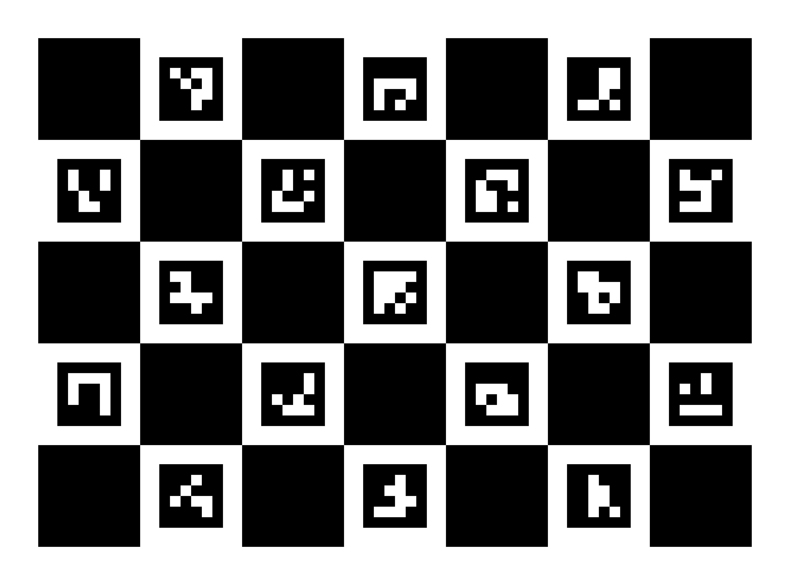
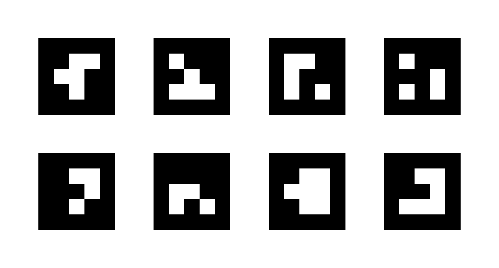
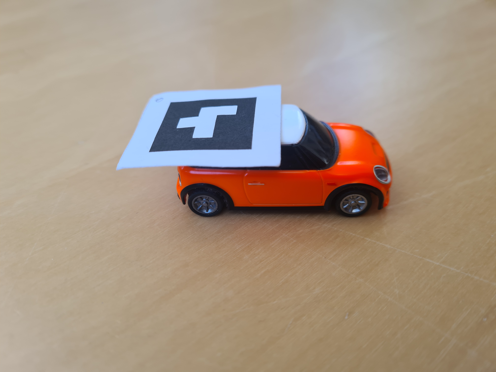

author: Frank Tränkle[^1]  
Hochschule Heilbronn, Germany
bibliography: ../lib/bib.bib
csl: ../lib/ieee.csl
link-citations: true
reference-section-title: References
title: MAD76 Installation

Installation Overview
=====================

<figure>
<figcaption>MAD76 System Architecture</figcaption>
</figure>

The installation steps are:

-   Build the MAD76 Box including the MAD76 IO PCB (see
    Section <a href="#mad76-box" data-reference-type="ref" data-reference="mad76-box">2</a>)

-   Connect the Turboracing Radio Controllers (RCs) to the MAD76 IO PCB
    (see
    Section <a href="#rc-cabling" data-reference-type="ref" data-reference="rc-cabling">3</a>)

-   Install Raspberry Pi OS, drivers, and ROS2 (see
    Section <a href="#raspberry-pi-installation" data-reference-type="ref" data-reference="raspberry-pi-installation">4</a>)

-   Optionally install ROS2 on optional Linux-PC for distributed
    computing and software-in-the-loop (SiL) simulation (see
    Section <a href="#linux-pc-installation" data-reference-type="ref" data-reference="linux-pc-installation">5</a>)

-   Calibrate the Raspberry Pi camera (see
    Section <a href="#camera-calibration" data-reference-type="ref" data-reference="camera-calibration">6</a>)

-   Install AruCo markers for computer vision (see
    Section <a href="#aruco-markers" data-reference-type="ref" data-reference="aruco-markers">7</a>)

-   Install MAD76 Driving Stack (see
    Section <a href="#mad76-driving-stack" data-reference-type="ref" data-reference="mad76-driving-stack">8</a>)

-   Optionally install MATLAB/Simulink for model-based software
    engineering (see
    Section <a href="#matlab-simulink-installation" data-reference-type="ref" data-reference="matlab-simulink-installation">9</a>)

MAD76 Box
=========

The MAD76 Box is a self-built housing for the MAD76 electronics
containing

-   Raspberry Pi (RPi)

-   MAD76 IO: self-built PCB electronics for coupling RPi to remote
    controllers (RC) for the Turbo Racing cars

-   Up to 4 RC cars are supported

This section first lists the bill of materials (BOM) for the MAD76 Box.
Then the MAD76 IO is described in more detail.

Bill of Materials (BOM)
-----------------------

### Raspberry Pi and Camera

<div id="T-bomrpi" markdown="1">

|     | Description                                                        | Part Id          | Order Link                                                                                                  |
|----:|:-------------------------------------------------------------------|:-----------------|:------------------------------------------------------------------------------------------------------------|
|    1| Raspberry PI 5 B 8GB Black Bundle                                  | RPI5 BBDL 8GB    | <https://www.reichelt.de/das-raspberry-pi-5-b-8gb-black-bundle-rpi5-bbdl-8gb-p362348.html>                  |
|    1| microSD-Card 128 GB                                                |                  | <https://www.rasppishop.de/Sandisk-microSDHC-UHS-I-128GB-Class10-mit-Raspberry-Pi-OS>                       |
|    1| Raspberry Pi Active Cooler                                         | RASP ACTIVE COOL | <https://www.reichelt.de/raspberry-pi-luefter-fuer-raspberry-pi-5-rasp-active-cool-p360116.html>            |
|    1| Raspberry Pi Global Shutter Camera, 1.6MP, C/CS mount              | RASP CAM GS CS   | <https://www.reichelt.de/raspberry-pi-kamera-1-6mp-shutter-c-cs-fassung-rasp-cam-gs-cs-p345205.html>        |
|    1| Raspberry Pi Lens, CS mount, 6mm wideangle                         | RPIZ CAM 6MM WW  | <https://www.reichelt.de/raspberry-pi-objektiv-fuer-cs-fassung-6mm-weitwinkel-rpiz-cam-6mm-ww-p276922.html> |
|    1| AZDelivery Flex Cable 50cm, compatible to Raspberry Pi Zero Camera |                  | <https://www.amazon.de/AZDelivery-Flexkabel-Raspberry-Zero-Display/dp/B07SQ3HKNF>                           |
|    1| Joby GorillaPod 3K Kit Tripod                                      |                  | <https://www.foto-erhardt.de/stative/joby-gorillapod/joby-gorillapod-3k-kit-black-charcoal.html>            |

</div>

### MAD76 IO

<div id="T-bommad76io" markdown="1">

|     | Description                              | Part Id                                                | Order Link                                                                                          |
|----:|:-----------------------------------------|:-------------------------------------------------------|:----------------------------------------------------------------------------------------------------|
|    1| Platine, Epoxyd, doppelseitig, 300x200mm | EP2CU 300X200                                          | <https://www.reichelt.de/de/de/shop/produkt/platine_epoxyd_doppelseitig_300_x_200_mm-7404>          |
|    4| MCP42010 10kOhm DIL-14                   | MCP 42010-I/P                                          | <https://www.reichelt.de/digitalpoti-2-kanal-256-schritte-10-kohm-dil-14-mcp-42010-i-p-p90112.html> |
|    1| L293B 1A DIP-16                          | L 293 B                                                | <https://www.reichelt.de/push-pull-4-kanal-treiber-1a-dip-16-l-293-b-p9660.html>                    |
|    4| 14-poliger DIL-Socket                    | GS 14P                                                 | <https://www.reichelt.de/ic-sockel-14-polig-superflach-gedreht-vergold--gs-14p-p8207.html>          |
|    1| 16-poliger DIL-Socket                    | GS 16P                                                 | <https://www.reichelt.de/ic-sockel-16-polig-superflach-gedreht-vergold--gs-16p-p8209.html>          |
|    4| Wannenstecker, 10-polig, gerade          | WSL 10G                                                | <https://www.reichelt.de/wannenstecker-10-polig-gerade-wsl-10g-p22816.html>                         |
|    1| Wannenstecker, 40-polig, gewinkelt       | WSL 40W                                                | <https://www.reichelt.de/wannenstecker-40-polig-gewinkelt-wsl-40w-p22836.html>                      |
|    6| SMD-Kondensator 100nF                    | KEM X7R0805 100N or X7R-G0805 100N or WAL 0805B104K500 | <https://www.reichelt.de/de/de/shop/produkt/vielschicht-kerko_100nf_50v_125_c-207073>               |
|    4| SMD-Kondensator 10uF                     | X5R-G0805 10/16 or KEM 0805 10U-2                      | <https://www.reichelt.de/de/de/shop/produkt/smd-vielschichtkondensator_g0805_-_10_f_16v-89734>      |

</div>

### Housing

<div id="T-bommad76housing" markdown="1">

|     | Description                                                                                                             | Part Id                        | Order Link                                                                                                                                                                                       |
|----:|:------------------------------------------------------------------------------------------------------------------------|:-------------------------------|:-------------------------------------------------------------------------------------------------------------------------------------------------------------------------------------------------|
|    1| Industriegehäuse, 250x160x90mm, IP65, lichtgrau                                                                         | 5U340000                       | <https://www.reichelt.de/industriegehaeuse-250-x-160-x-90-mm-ip65-lichtgrau-5u340000-p324394.html>                                                                                               |
|    1| 40-poliges Flachbandkabel 30cm                                                                                          | RPI GPIO40 300                 | <https://www.reichelt.de/raspberry-pi-gpio-kabel-40-pin-30cm-grau-rpi-gpio40-300-p293579.html>                                                                                                   |
|    4| Pfostenverbinder 2,54mm 2x5 (Flachbandkabel)                                                                            | BKL 10120668                   | <https://www.reichelt.de/de/de/shop/produkt/pfostenverbinder_2_54mm_2x5-262790>                                                                                                                  |
|    1| sourcing map 20Stk. M2,5x8mm+5mm Stecker Buchse Messing PCB Motherboard Abstandhalter Ständer                           |                                | <https://www.amazon.de/gp/product/B08G1TP68G>                                                                                                                                                    |
|    1| 300 Stück M2.5 Schrauben Set M2.5 Hex Flach-Knopf Schraube Set, A2 Edelstahl Innensechskantschrauben Schraubensortiment |                                | <https://www.amazon.de/gp/product/B08B648WWQ>                                                                                                                                                    |
|    8| JST-Buchsengehäuse, 1x3-polig                                                                                           | JST PH3P BU or 571-440129-3    | <https://www.reichelt.de/jst-buchsengehaeuse-1x3-polig-ph-jst-ph3p-bu-p185042.html> <https://www.mouser.de/ProductDetail/571-440129-3>                                                           |
|   24| JST-Crimpkontakt, Buchse or 2.0mm, Crimp Contact Cut Strip of 100                                                       | JST PH CKS or 571-1735801-1-CT | <https://www.reichelt.de/de/de/shop/produkt/jst_-_crimpkontakt_buchse_-_ph-185072> <https://www.mouser.de/ProductDetail/TE-Connectivity-AMP/1735801-1-Cut-Strip?qs=oXydCMRm13w8Ga1ULORh6A%3D%3D> |

</div>

### Turbo Racing Cars

<div id="T-bommad76cars" markdown="1">

|        | Description                                                          | Part Id | Order Link                                                                                                                                  |
|-------:|:---------------------------------------------------------------------|:--------|:--------------------------------------------------------------------------------------------------------------------------------------------|
|  1 to 4| Turbo Racing 1:76 Mini Cooper with RC <https://www.turboracing.net/> |         | <https://www.rcfox.de/TB-TR01-Turbo-Racing-1/76-Micro-Mini-Cooper> <https://de.aliexpress.com/item/1005001936818767.html>                   |
|       1| Turbo Racing Mat Track 50x95cm                                       |         | <https://www.rcfox.de/TB-760101-Turbo-Racing-Race-Strecke-fuer-Micro-Rally-50x95-cm> <https://de.aliexpress.com/item/1005006267808509.html> |

</div>

MAD76 IO
--------

-   MAD76 IO is the bridge from RPi to the Turbo Racing RCs.

-   MAD76 IO controls up to 4 cars.

-   MAD76 IO substitutes and emulates the two potentiometers for
    throttle/braking and steering by digital potis (MCP42010) for each
    car.

-   MAD76 further provides the power supply of 5V for the RCs.

-   The power supply is controlled individually for each RC by an L293B.

-   The RPi controls the digital potis via SPI.

-   The RPi controls the L293B via GPIO.

-   The MAD76 IO is connected to the RPi via a standard RPi 40-pin GPIO
    cable.

-   The MAD76 IO is connected to the RCs via 8-pin flat ribbon cables.

<figure>
<figcaption>MAD76 IO Schematics Page 1 (Eagle schematics <a href="../../pcb/MAD76.sch">../../pcb/MAD76.sch</a>)</figcaption>
</figure>

<figure>
<figcaption>MAD76 IO Schematics Page 2 (Eagle schematics <a href="../../pcb/MAD76.sch">../../pcb/MAD76.sch</a>)</figcaption>
</figure>

<figure>
<figcaption>MAD76 IO Board Layout (Eagle layout <a href="../../pcb/MAD76.brd">../../pcb/MAD76.brd</a>)</figcaption>
</figure>

RC Cabling
==========

<figure>
<figcaption>RC Cabling</figcaption>
</figure>

-   Connect the ribbon cables to the 4 RCs and the ports SV1, SV2, SV3,
    and SV4 on the MAD76 IO board

-   Use a length of at least 170mm for the 10-pin ribbon cables

-   In
    Figure <a href="#f-rc-cabling" data-reference-type="ref" data-reference="f-rc-cabling">5</a>,
    the nose of the black SV1 connector is facing upward

-   Solder the 5V and GND wires (SV1 pins 1 and 2) to the RC power
    supply pads

-   Pins 3 and 4 are not used and can be cut off

-   Crimp steering poti wires (SV1 pins 5, 6, 7) to the upper JST
    connector (from top to bottom)

-   Crimp motor poti wires (SV1 pins 8, 9, 10) to the middle JST
    connector (from top to bottom)

-   Please note that the cabling is designed in such a nice way, such
    that the individual wires of the ribbon cable do not cross each
    other

-   Connect the cable to SV 1 of MAD76 IO

Raspberry Pi Installation
=========================

Raspberry Pi OS
---------------

-   Download and start installer \[[1](#ref-raspberrypi-sw)\]

    -   Rasberry Pi OS with desktop (Debian 12 Bookworm 64-bit)

    -   Configure `<username>`

    -   Configure `<hostname>`

    -   Configure WiFi

    -   Enable SSH

-   Login: `ssh <username>@<hostname>`

-   Update Debian

    ``` bash
    sudo apt-get update
    sudo apt-get dist-upgrade
    # reboot in case of kernel/firmware updates
    sudo shutdown -r 0 
    ```

Raspberry Pi Configuration
--------------------------

-   Enable SPI for MAD76 IO

    -   `sudo raspi-config`

    -   Goto menu `3 Interface Options`

    -   Select `I4 SPI`

VNC Server
----------

VNC Server allows you to remotely connect to the Raspberry Pi from your
development PC, either Linux, Windows or MacOS.

-   Remove RealVNC

    ``` bash
    sudo apt-get purge realvnc-vnc-server
    ```

-   Install VNC server

    ``` bash
    sudo apt-get install tigervnc-standalone-server
    sudo apt-get install tigervnc-xorg-extension
    ```

-   Start VNC server

    ``` bash
    vncserver -localhost no -geometry 2550x1350 -depth 24
    ```

-   Connect to VNC server from your VNC client: `<hostname>:1`

-   TightVNC on Windows or Remmina on Linux are popular VNC clients.

Python Coding
-------------

``` bash
sudo apt-get purge python3-rpi.gpio      # remove GPIO library for RPi4
sudo apt-get install python3-rpi-lgpio   # install GPIO library for RPi5
sudo apt-get install python3-ipykernel   # install Jupyter kernel
sudo apt-get install python3-sphinx      # install Sphinx for code documentation
```

WiringPi
--------

WiringPi is a GPIO library for C / C++ programming that is used to
access the MAD76 IO board.

-   Install WiringPi for MAD76 IO

    ``` bash
    cd
    mkdir src
    cd src
    git clone https://github.com/WiringPi/WiringPi.git
    cd WiringPi
    ./build
    ```

ROS2
----

ROS2 is the middleware for the MAD76 software stack.

-   ROS2 Jazzy Jalisco is required. No other ROS2 distribution is
    supported because of compatibility to both Debian Bookworm and
    MATLAB/Simulink R2025a.

-   Building ROS2 Jazzy Jalisco from source
    \[[2](#ref-ros-buildonlinux)\],
    \[[3](#ref-ros-installubuntusource)\]

    ``` bash
    mkdir -p ~/src/ros2_jazzy/src
    cd ~/src/ros2_jazzy

    locale  # check for UTF-8

    sudo apt-get install \
      build-essential \
      cmake \
      git \
      python3-colcon-bash \
      python3-pip \
      vcstool \
      wget

    sudo apt-get install sqlite3
    sudo apt-get install python3-lark python3-netifaces
    sudo apt-get install python3-flake8-blind-except python3-flake8-builtins python3-flake8-class-newline python3-flake8-comprehensions    python3-flake8-deprecated    python3-flake8-import-order python3-flake8-quotes python3-pytest-repeat python3-pytest-rerunfailures
    sudo apt-get install python3-rosdep2 python3-vcstools
    sudo apt-get install python3-opencv python3-scipy python3-matplotlib
    sudo apt-get install python3-flask python3-peewee
    sudo apt-get install libbullet-dev libboost-dev
    sudo apt-get install libasio-dev libtinyxml2-dev
    sudo apt-get install qtbase5-dev qtbase5-dev-tools
    sudo apt-get install libacl1-dev libcap-dev libssl-dev libxaw7-dev libogre-1.12-dev libeigen3-dev 
    sudo apt-get install libopencv-dev
    sudo apt-get install liblttng-ust-dev
    sudo apt-get install libboost-python-dev libboost-system-dev libboost-log-dev libgtest-dev libjsoncpp-dev
    sudo apt-get install netcat-openbsd netcat-openbsd

    wget https://raw.githubusercontent.com/ros2/ros2/jazzy/ros2.repos
    vcs import src < ros2.repos

    rosdep update
    rosdep install --from-paths src --ignore-src --rosdistro jazzy -y --skip-keys "rti-connext-dds-6.0.1 python3-vcstool"

    touch src/eclipse-cyclonedds/COLCON_IGNORE
    touch src/eclipse-iceoryx/COLCON_IGNORE
    touch src/gazebo-release/COLCON_IGNORE
    touch src/ros2/rviz/COLCON_IGNORE
    touch src/ros2/rmw_connextdds/COLCON_IGNORE
    touch src/ros2/rmw_cyclonedds/COLCON_IGNORE

    colcon build --symlink-install --cmake-args -DCMAKE_BUILD_TYPE=Release
    ```

-   Install ROS2 packages for camera, diagnostics, and Xbox controller

    ``` bash
    sudo apt-get install libcamera-dev
    source ~/src/ros2_jazzy/install/setup.bash
    mkdir -p /src/ros_ws/src
    cd ~/src/ros_ws/src
    git clone https://github.com/ros/diagnostics.git -b ros2-jazzy  
    git clone https://github.com/ros-perception/vision_opencv.git -b rolling
    git clone https://github.com/christianrauch/camera_ros -b main
    git clone https://github.com/ros-drivers/joystick_drivers -b ros2
    touch joystick_drivers/ps3joy/COLCON_IGNORE
    touch joystick_drivers/spacenav/COLCON_IGNORE
    touch joystick_drivers/wiimote/COLCON_IGNORE
    touch joystick_drivers/wiimote_msgs/COLCON_IGNORE
    cd ..
    colcon build --symlink-install --cmake-args -DCMAKE_BUILD_TYPE=Release  
    ```

Update ROS2
-----------

If you want to update ROS2 later on, you can do the following.

-   Update ROS2 distribution

    ``` bash
    cd ~/src/ros2_jazzy
    vcs custom --args remote update
    vcs import src < ros2.repos
    vcs pull src
    colcon build --symlink-install --cmake-args -DCMAKE_BUILD_TYPE=Release
    ```

-   Update ROS2 packages for camera and diagnostics

    ``` bash
    cd ~/src/ros_ws/src
    cd diagnostics
    git pull
    cd ../vision_opencv
    git pull
    cd ../camera_ros
    git pull
    cd ../joystick_drivers
    git pull
    cd ../..
    source ~/src/ros2_jazzy/install/setup.bash
    colcon build --symlink-install --cmake-args -DCMAKE_BUILD_TYPE=Release
    ```

Xbox One Controllers
--------------------

Optionally, Xbox One controllers can be used to manually control the
MAD76 cars in car racing mode.

-   Enable Bluetooth Low Energy (BLE) privacy, so that Xbox One
    controllers can be paired to Raspberry Pi

    -   Add line `Privacy=device` to the `[General]` section of
        `/etc/bluetooth/main.conf` according to
        <https://www.reddit.com/r/linux_gaming/comments/js0trh/comment/gddwyjk/>

-   Follow the instructions on
    <https://pimylifeup.com/xbox-controllers-raspberry-pi/>

Linux-PC Installation
=====================

Next to the Raspberry Pi installation, MAD76 may be further installed
optionally on a Linux PC. The Linux PC allows for more efficient MAD76
software development and debugging. Furthermore, MAD76 may be run in
Software-in-the-Loop (SiL) simulation mode on the Linux PC.
MATLAB/Simulink may be applied for model-based software engineering of
MAD76. For controlling the real MAD76 system, The MAD76 software stack
may be run on a distributed ROS2 environment including the Raspberry Pi
and the Linux PC.

-   Install an Ubuntu Desktop version that supports ROS2 Jazzy Jalisco,
    such as Ubuntu Noble Numbat 24.04
    \[[4](#ref-ubuntu-alternativedownloads)\]. ROS2 Jazzy Jalisco (and
    no other ROS2 version) is required, otherwise distributed computing
    with PC and Raspberry Pi will not work.

-   However, if you only want to run MAD76 in Software-in-the-Loop (SiL)
    simulation mode only, you may use other ROS2 and Linux
    distributions.

-   Install ROS2 Jazzy Jalisco binary (deb) packages according to
    \[[5](#ref-ros-installubuntudeb)\]. Make sure to install the
    following ROS2 packages:

    ``` bash
    sudo apt-get install ros-dev-tools ros-jazzy-desktop ros-jazzy-diagnostic-updater
    ```

Camera Calibration
==================

<figure>
<figcaption>ChArUco board for camera calibration.</figcaption>
</figure>

The Raspberry Pi camera must be calibrated, so that the MAD76 software
can undistort the camera image frames
\[[6](#ref-ros-camera-calibration)\]. The calibration is performed
applying an ChArUco board, which is an augmentation of a chess board by
AruCo markers for higher precision. Follow the following steps for
calibrating your camera:

-   Print the marker board in
    Fig. <a href="#F-charuco" data-reference-type="ref" data-reference="F-charuco">6</a>
    on a snow-white DIN-A4 paper. Use high-quality printer settings.

-   Scale the printing such that the black area of the AruCo markers has
    a height and width of 21mm each.

-   This PNG image can optionally be created by

        cd ~/src/mad2/mad_ws
        install/mbmadvisionaruco/lib/mbmadvisionaruco/create_board_charuco -d=0 -w=7 -h=5 -ml=500 -sl=800 charucoboard.png

-   Fix this paper on a cardboard.

-   Calibrate the camera by running the following command:

        ros2 run camera_calibration cameracalibrator --pattern=charuco --size 7x5 --square 0.036 --charuco_marker_size 0.022 --aruco_dict 4x4_50 image:=/mad/camera/image_raw camera:=/mad/camera camera/set_camera_info:=/mad/camera/set_camera_info

-   After successful calibration the camera matrix and distortion
    coefficients are stored in the file

        ~/.ros/camera_info/imx296__base_axi_pcie_120000_rp1_i2c_88000_imx296_1a_800x600.yaml

    or similar.

-   This calibration data file will then be automatically loaded by the
    MAD76 computer vision for undistorting camera frames.

AruCo Markers
=============

MAD76 applies AuUco markers in computer vision for detecting and
tracking cars. This section explains

-   how to generate and print the markers (see
    Section <a href="#marker-generation" data-reference-type="ref" data-reference="marker-generation">7.1</a>),

-   how to place the coordinate frame markers (see
    Section <a href="#frame-markers" data-reference-type="ref" data-reference="frame-markers">7.2</a>),

-   how to place the car markers (see
    Section <a href="#car-markers" data-reference-type="ref" data-reference="car-markers">7.3</a>),

Marker Generation
-----------------

<figure>
<figcaption>AruCo markers for cars and coordinate frame.</figcaption>
</figure>

-   The cars are tracked by ArUco markers \[[7](#ref-opencv-aruco)\].

-   Computer vision computes the Cartesian coordinates and the yaw
    angles of the cars.

-   The markers are generated with the OpenCV ArUco library.

-   A custom ArUco dictionary of 8 markers with a size of 3x3 bits is
    used to increase the reliability of computer vision.

-   The PNG image of the 8 markers can be optionally created by

        cd ~/src/mad2/mad_ws
        install/mbmadvisionaruco/lib/mbmadvisionaruco/create_board --bb=1 -d=17 -w=4 -h=2 -l=200 -s=100 markers.png

-   The markers IDs are from 0 to 7, 0 to 3 in the first row from left
    to right, and 4 to 7 in the second row.

-   Print the markers in
    Fig. <a href="#F-markers" data-reference-type="ref" data-reference="F-markers">7</a>
    on a snow-white, 80 grams paper.

    -   Make sure to configure high quality printing.

    -   Scale the printing such that the black area of the markers have
        a height and width of 21mm each.

-   Cut the markers as squares including approx. 5mm boundaries.

-   Note the marker IDs before cutting with a thin pencil on the
    boundaries, because you will need these IDs later on.

Frame Markers
-------------

<figure>
<figcaption>Track with 4 coordinate frame markers.</figcaption>
</figure>

-   4 frame markers define the coordinate frame of the track.

-   All coordinates of cars and track are measured in meters.

-   The frame origin $(s_{01},s_{02})=(0\mathrm{m},0\mathrm{m})$ is at
    the center point of marker ID4.

-   Place frame markers with IDs 4, 5, 6, 7 at corners of board as
    depicted in figure.

    -   It is recommended to place the markers with high accuracy in the
        1mm range. Otherwise, the control functions of the MAD76 driving
        stack will loose precision.

    -   Although modified distances may be later configured in the ROS2
        package `mbmadvisionaruco`.

    -   The distances are measured at the marker center points.

    -   The markers must form a rectangle.

    -   The sequence of the marker IDs is essential.

Car Markers
-----------

<figure>
<figcaption>Red car with marker ID 0.</figcaption>
</figure>

-   Each car has its individual marker.

-   The following configuration is recommended:

    | Marker ID | Car                  |
    |:----------|:---------------------|
    | 0         | orang / red orange   |
    | 1         | green yellow / white |
    | 2         | blue / white         |
    | 3         | white                |

-   If you have fewer than four cars, please start with ID 0 in any
    case.

-   Each marker’s center point must be placed exactly at the car’s rear
    axle center point.

-   The horizontal orientation of the marker must match to the forward
    direction of the car.

MAD76 Driving Stack
===================

Software Architecture
---------------------

<figure>
<figcaption>ROS2 nodes of MAD76 Driving Stack</figcaption>
</figure>

<div id="T-ros2nodes" markdown="1">

| ROS2 Node     | Description                                                        |
|:--------------|:-------------------------------------------------------------------|
| `camera_node` | Rasberry Pi camera driver                                          |
| `visionnode`  | computer vision                                                    |
| `locatenode`  | multi-object tracking                                              |
| `carctrlnode` | motion planning and control for each individual car                |
| `rcnode`      | remote control signals output to $2.4\mathrm{GHz}$ channel via SPI |
| `tracknode`   | track map                                                          |
| `joy_node`    | optional node for manual control via joystick                      |

</div>

<div id="T-ros2topics" markdown="1">

| ROS2 Topic                  | ROS2 Message Type                   | Description                                                  |
|:----------------------------|:------------------------------------|:-------------------------------------------------------------|
| `/mad/camera/image_raw`     | `sensor_msgs::msg::Image`           | camera frames with sampling time $25\mathrm{ms}$             |
| `/mad/camera/camera_info`   | `sensor_msgs::msg::CameraInfo`      | camera calibration info                                      |
| `/mad/vision/caroutputs`    | `mbmadmsgs::msg::CarOutputsList`    | list of car poses                                            |
| `/mad/locate/caroutputsext` | `mbmadmsgs::msg::CarOutputsExtList` | list of car poses including velocities (deprecated)          |
| `/mad/locate/carobs`        | `mbmadmsgs::msg::CarObsList`        | list of car states and Frenet coordinates w.r.t. center line |
| `/mad/car?/carinputs`       | `mbmadmsgs::msg::CarInputs`         | control signals for each individual car                      |
| `/mad/car?/maneuver`        | `mbmadmsgs::msg::DriveManeuver`     | maneuvers for path following and parking                     |
| `/mad/car?/joy`             | `sensor_msgs::msg::Joy`             | standard ROS2 joystick messages                              |

</div>

Build MAD76
-----------

-   MAD76 can be built and run on Raspberry Pi and on Ubuntu Linux
    computers

-   ROS2 nodes can run on distributed system with multiple computers

-   ROS2 nodes `camera_node` and `rc_node` must run on the Raspberry Pi
    for interfacing with the camera and Turboracing remote controllers

-   All other nodes can run on other computers

-   ROS2 supports this distributed computing transparently when setting
    a common ROS domain ID

-   For running MAD76 in Software-in-the-Loop (SiL) simulation mode (see
    Section <a href="#software-in-the-loop-simulation" data-reference-type="ref" data-reference="software-in-the-loop-simulation">8.3</a>),
    a build of MAD76 on an Ubuntu Linux-PC is sufficient because SiL
    mode does not do any input / output, except for optional joystick
    control

-   Clone Git repository and build MAD76 workspace

    ``` bash
    export RMW_IMPLEMENTATION=rmw_fastrtps_cpp
    export ROS_DOMAIN_ID=221
    source ~/src/ros_ws/install/setup.bash # on Raspberry Pi
    #source /opt/ros/jazzy/setup.bash # on Ubuntu Linux-PC
    cd ~/src
    git clone https://github.com/modbas/mad76
    cd mad76/mad_ws
    colcon build --symlink-install --cmake-args -DCMAKE_BUILD_TYPE=Release
    ```

    For building on Raspberry Pi, the `colcon build` command must be
    extended by `–parallel-workers 1` to avoid out-of-memory problems

    ``` bash
    colcon build --parallel-workers 1 --symlink-install --cmake-args -DCMAKE_BUILD_TYPE=Release
    ```

-   Add security limits

    ``` bash
    sudo addgroup mad
    sudo adduser <username> mad # where <username> is your username
    sudo -i
    echo "@mad		 -	 rtprio		 98" >> /etc/security/limits.conf
    echo "@mad		 -	 memlock	 unlimited" >> /etc/security/limits.conf
    shutdown -r 0 # reboot
    ```

-   Add the following lines to the end of `~/.bashrc` for automatic
    setup

    ``` bash
    export RMW_IMPLEMENTATION=rmw_fastrtps_cpp
    export ROS_DOMAIN_ID=221
    source ~/src/mad76/mad_ws/install/setup.bash
    ```

Software-in-the-Loop Simulation
-------------------------------

<figure>
<figcaption>ROS2 nodes in SiL simulation mode</figcaption>
</figure>

-   In order to test your MAD76 installation, you may run MAD76 in
    software-in-the-loop (SiL) simulation mode

    -   The real cars, the camera, and the ROS2 nodes `camera_node`,
        `vision_node` and `rc_node` for computer vision and RC output
        are replaced by simulation models

    -   The MAD76 Driving Stack runs in the loop with vehicle dynamics
        simulation models

    -   Full operation of the driving stack is supported in SiL
        simulation mode

-   Open a new terminal and start MAD76 in SiL mode

    ``` bash
    ros2 launch mbmad madpisim.launch
    ```

-   Open a further terminal and start all cars in a driverless race

    ``` bash
    ros2 run mbmadcar send_maneuver.py
    ```

MATLAB-Simulink Installation
============================

-   MATLAB/Simulink may be optionally installed for model-based software
    engineering of MAD76 driving stacks.

-   The following MATLAB release and toolboxes are required

    -   MATLAB R2025a

    -   Simulink

    -   Stateflow

    -   Control-System-Toolbox

    -   Curve-Fitting-Toolbox

    -   ROS-Toolbox

    -   Simulink Coder

    -   Embedded Coder

-   For model-in-the-loop (MiL) simulation and control design, MATLAB
    can be installed on any supported platform

-   For code generation and MAD76 programming, MATLAB needs to be
    installed on the MAD76 Linux PC

Python 3.10 Installation
------------------------

-   MATLAB ROS-Toolbox requires Python 3.10 which is not installed per
    default on Ubuntu Noble Numbat 24.04

-   The default Python 3.12 installation does not work

-   Install Python 3.10 on the MAD76 Linux PC from the PPA `Deadsnakes`

    ``` bash
    sudo add-apt-repository ppa:deadsnakes/ppa
    sudo apt update
    sudo apt install python3.10 python3.10-venv
    ```

-   Activate Python 3.10 in MATLAB ROS-Toolbox

    1.  Open MATLAB Settings ROS-Toolbox

    2.  Browse for `/usr/bin/python3.10`

    3.  Hit pushbutton `Recreate Python Environment`

    4.  Select `rmw_fastrtps_cpp` as ROS Middleware

ROS Custom Messages
-------------------

-   Make custom ROS message types of MAD76 available in MATLAB/Simulink
    (only needed for code generation)

    1.  ROS2 Jazzy Jalisco and MAD76 must be installed on the MAD76
        Linux PC running Ubuntu Noble Numbat 24.04 (see
        <https://github.com/modbas/mad76/blob/main/doc/install/install.md#linux-pc-installation>)

    2.  At the MATLAB prompt, change to the ROS workspace directory

        ``` matlab
        cd ~/src/mad76/mad_ws
        ```

    3.  Generate MATLAB/Simulink objects for the custom ROS message
        types

        ``` matlab
        ros2genmsg src
        ```

    4.  Test if the message types are available in MATLAB/Simulink

        ``` bash
        ros2 msg list
        ```

        This displayed list must contain message types `mbmadmsgs/*` and
        `mbsafemsgs/*`

References [bibliography]
==========

<div id="refs" class="references" markdown="1">

<div id="ref-raspberrypi-sw" markdown="1">

\[1\] Raspberry Pi Foundation, “Raspberry Pi Software.” 2024. Available:
<https://raspberrypi.com/software>

</div>

<div id="ref-ros-buildonlinux" markdown="1">

\[2\] ROS, “Building ROS2 on Linux.” 2024. Available:
<https://docs.ros.org/en/eloquent/Installation/Linux-Development-Setup.html>

</div>

<div id="ref-ros-installubuntusource" markdown="1">

\[3\] ROS, “Installation Alternatives Ubuntu (Source).” 2025. Available:
<https://docs.ros.org/en/jazzy/Installation/Alternatives/Ubuntu-Development-Setup.html>

</div>

<div id="ref-ubuntu-alternativedownloads" markdown="1">

\[4\] Canonical Ubuntu, “Alternative Downloads.” 2025. Available:
<https://ubuntu.com/download/alternative-downloads>

</div>

<div id="ref-ros-installubuntudeb" markdown="1">

\[5\] ROS, “Installation Ubuntu (deb packages).” 2025. Available:
<https://docs.ros.org/en/jazzy/Installation/Alternatives/Ubuntu-Install-Binary.html>

</div>

<div id="ref-ros-camera-calibration" markdown="1">

\[6\] ROS, “How to Calibrate a Monocular Camera.” 2025. Available:
<https://wiki.ros.org/camera_calibration/Tutorials/MonocularCalibration>

</div>

<div id="ref-opencv-aruco" markdown="1">

\[7\] OpenCV, “Detection of ArUco Markers.” 2025. Available:
[https://docs.opencv.org/4.x/d5/dae/tutorial\\\_aruco\\\_detection.html](https://docs.opencv.org/4.x/d5/dae/tutorial\_aruco\_detection.html)

</div>

</div>

[^1]: frank.traenkle@hs-heilbronn.de
