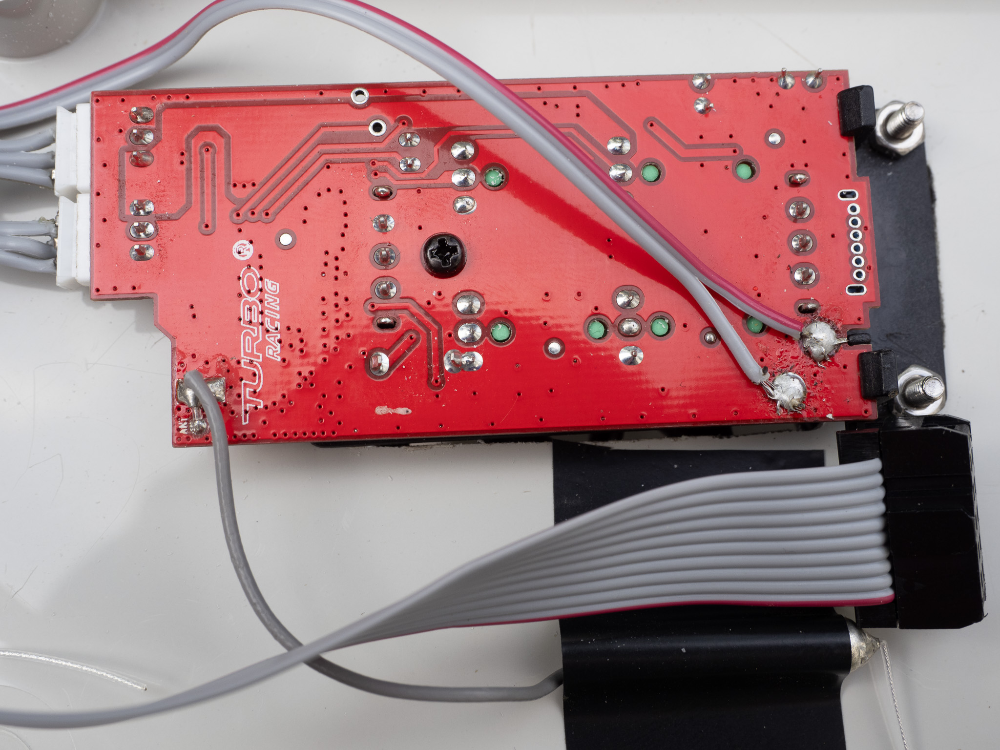

author: Frank Tränkle[^1]  
Hochschule Heilbronn, Germany
bibliography: ../lib/bib.bib
csl: ../lib/ieee.csl
link-citations: true
reference-section-title: References
title: Remote Controllers (RCs)

Agenda
======

-   Connect remote controllers (RCs) to MAD76 IO (see
    Section <a href="#rc-cabling" data-reference-type="ref" data-reference="rc-cabling">2</a>)

-   Calibrate RCs (see
    Section <a href="#rc-calibration" data-reference-type="ref" data-reference="rc-calibration">3</a>)

RC Cabling
==========

<figure>
<figcaption>RC Cabling</figcaption>
</figure>

-   Ribbon cables connect the 4 RCs to ports SV1, SV2, SV3, and SV4 on
    the MAD76 IO board

-   Use a length of at least 170mm for the 10-pin ribbon cables

-   In
    Figure <a href="#f-rc-cabling" data-reference-type="ref" data-reference="f-rc-cabling">1</a>,
    the nose of the black SV1 connector is facing upward

-   Solder the 5V and GND wires (SV1 pins 1 and 2) to the RC power
    supply pads

-   Pins 3 and 4 are not used and can be cut off

-   Crimp steering poti wires (SV1 pins 5, 6, 7) to the upper JST
    connector (from top to bottom)

-   Crimp motor poti wires (SV1 pins 8, 9, 10) to the middle JST
    connector (from top to bottom)

-   Please note that the cabling is designed in such a nice way, such
    that the individual wires of the ribbon cable do not cross each
    other

-   Connect the cable to SV 1 of MAD76 IO

RC Calibration
==============

<figure>
<figcaption>RC Buttons</figcaption>
</figure>

Rationale [rationale]
---------

-   The cars have tolerances in steering, motor propulsion and friction

-   The RC microcontrollers ($\mu$Cs) have tolerances in the 3.3V power
    supply for the potentiometers

-   Due to these tolerances, each RC-to-car-coupling must be calibrated
    individually

-   For calibration, **the car must be switched on before switching on
    the RC**

-   By calibration, all cars will show similar dynamic behavior, such
    that all cars can be controlled by the same MAD76 driving stack with
    good performance

Before you start [before-you-start]
----------------

1.  If MAD76 is running, switch off the RC by stopping ROS by hitting
    `Ctrl-C` in the terminal

2.  Move the RC button `on/off` to the `on` position, since MAD76 IO
    will do the powering automatically by the L293B

3.  Move the button `reverse steering` to the `NOR` position, which
    typically is for right-handed drivers

4.  Adjust the knobs `thrust level` and `steering level` all the way to
    the limit `10` in counter-clockwise direction, so that the car will
    show maximal performance

5.  Switch on the car

6.  Switch on the RC by starting MAD76 in manual mode with the following
    ROS command in a terminal:

        ros2 launch mbmad madpiman.launch

    This command starts the I/O of MAT76 but not the driving stack. Omit
    this step if you want to use the Python program `rctest.py` from
    MAD76 Academy [MAD76 I/O
    Programming](../teachmad76io/teachmad76io.md)

7.  If the car has not been coupled to the RC, yet (the car’s headlights
    are flashing), the coupling must be done now

    1.  Switch off all other RCs and cars

    2.  Initiate the coupling process by placing a needle into the
        couple hole on the bottom of the car

    3.  Wait for the car’s headlights to stop flashing, indicating a
        successful coupling

Calibrate the motor [calibrate-the-motor]
-------------------

1.  Calibrate standing still

    1.  Adjust RC knobs `thrust trim` and `steering trim` to the neutral
        center positions, as depicted in
        Figure <a href="#f-rc-buttons" data-reference-type="ref" data-reference="f-rc-buttons">2</a>

    2.  Set the normalized motor signal to zero: $u_n = 0$ by running
        the ROS command

            ros2 topic pub -1 /mad/car0/carinputs mbmadmsgs/msg/CarInputs "{carid: 0, pedals: 0.0, steering: 0.0}"

        or by running the Python program `rctest.py` from MAD76 Academy
        [MAD76 I/O Programming](../teachmad76io/teachmad76io.md)

            python rctest.py 0 0.0 0.0

        The command line arguments are

        | argument   | description                                       |
        |:-----------|:--------------------------------------------------|
        | `carid`    | ID of the RC and car (0, 1, 2 or 3)               |
        | `pedals`   | normalized motor signal $u_n \in [-1, 1]$         |
        | `steering` | normalized steering signal $\delta_n \in [-1, 1]$ |

    3.  Adjust RC knob `thrust trim` until the car stops and is in
        standing still

2.  Calibrate break-off-torques to overcome friction to identical values
    for forward and reverse motion

    1.  Increase $u_n$ in small steps from $0$ to $0.06$

            ros2 topic pub -1 /mad/car0/carinputs mbmadmsgs/msg/CarInputs "{carid: 0, pedals: 0.01, steering: 0.0}"
            ros2 topic pub -1 /mad/car0/carinputs mbmadmsgs/msg/CarInputs "{carid: 0, pedals: 0.02, steering: 0.0}"

            ...

        or by running the Python program `rctest.py`. The car should
        start moving forward at $u_n \approx 0.04$. If not, adjust the
        RC knob `thrust trim`.

    2.  Decrease $u_n$ in small steps from $0$ to $-0.06$

            ros2 topic pub -1 /mad/car0/carinputs mbmadmsgs/msg/CarInputs "{carid: 0, pedals: -0.01, steering: 0.0}"
            ros2 topic pub -1 /mad/car0/carinputs mbmadmsgs/msg/CarInputs "{carid: 0, pedals: -0.02, steering: 0.0}"
            ...

        or by running the Python program `rctest.py`. The car should
        start moving backward at $u_n \approx -0.04$. If not, adjust the
        RC knob `thrust trim`.

    3.  Repeat this calibration procedure until the car starts moving
        forward and backward at the same absolute level, e.g.,
        $|u_n| \approx 0.04$

Calibrate the steering [calibrate-the-steering]
----------------------

1.  Set

    -   the normalized steering signal to zero for straight driving:
        $\delta_n = 0$

    -   the normalized motor signal for little thrust:
        $u_n \approx 0.06$

    by running the ROS command

        ros2 topic pub -1 /mad/car0/carinputs mbmadmsgs/msg/CarInputs "{carid: 0, pedals: 0.06, steering: 0.0}"

    or by running the Python program `rctest.py` from [MAD76 I/O
    Programming](../teachmad76io/teachmad76io.md)

        python rctest.py 0 0.06 0.0

2.  The car should move on a straight line. If not, adjust RC button
    `steering trim`

3.  Check if the steering is operating with no faults in the total range
    $\delta_n = [-1,1]$ by running `ros2 topic pub` or `rctest.py` with
    varying steering inputs

[^1]: frank.traenkle@hs-heilbronn.de
