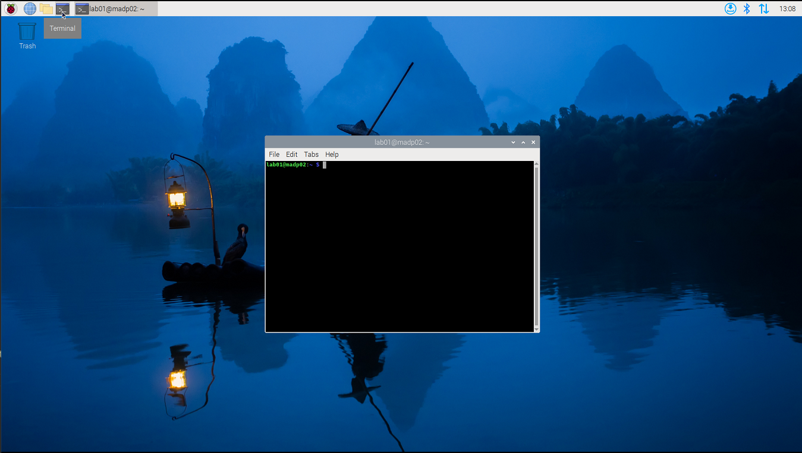

author: Frank Tränkle[^1]  
Hochschule Heilbronn, Germany
bibliography: ../lib/bib.bib
csl: ../lib/ieee.csl
link-citations: true
reference-section-title: References
title: MAD76 Academy: Linux

Agenda
======


-   What is Linux? Why Linux? (see
    Section <a href="#what-is-linux" data-reference-type="ref" data-reference="what-is-linux">2</a>)

-   Computer Architecture (see
    Section <a href="#computer-architecture" data-reference-type="ref" data-reference="computer-architecture">3</a>)

-   Linux Users (see
    Section <a href="#linux-users" data-reference-type="ref" data-reference="linux-users">4</a>)

-   Linux File System (see
    Section <a href="#linux-file-system" data-reference-type="ref" data-reference="linux-file-system">5</a>)

-   Networking Basics (see
    Section <a href="#networking-basics" data-reference-type="ref" data-reference="networking-basics">6</a>)

#### Teaching Objectives

-   Understand the basic concepts of Linux

-   Understand computer architectures (Raspberry Pi as example)

-   Learn about the role of an operating system and why Linux is a
    popular choice

-   Gain knowledge about Linux users and permissions

-   Familiarize with the Linux file system structure

-   Understand Linux as a networking operating system

-   Learn about common Linux commands and their usage

What is Linux
=============


-   Linux is a multi-user, multi-tasking *operating system (OS)*
    \[[1](#ref-linux-in-a-nutshell)\]

    -   Other OS are: Windows, macOS, iOS, Android (which includes
        Linux)

-   Linux is a Unix-like OS

-   Other Unixes are: FreeBSD (basis of macOS), AT&T Unix, IBM AIX,
    Sun/Oracle Solaris, QNX

-   An OS is an intermediate layer between hardware (HW) and software
    applications (SW apps, programs)

    -   Apps can be programmed once and run on many different HW
        platforms

-   An OS in itself is SW

-   Main features of an OS

    -   HW drivers for computer graphics, network, sound, micro, touch,
        cameras, radars, robots etc.

    -   File system management for data storage

    -   Process/thread management for running apps in parallel

    -   User management for multi-user systems

    -   Security management for protecting data and processes

    -   Application programming interfaces (API) for apps to access OS
        features

    -   User interfaces (UI) for user interaction: graphical (GUI),
        textual, audio, touch etc.

-   Linux consists of

    -   Linux Kernel (protected kernelland, main features)

    -   GNU userland (utilities, libraries, C/C++ compilers)

    -   additional software packages (GUI desktops, apps, libraries,
        programming languages, programming tools, server software)

-   Linux is distributed in Linux Distributions (Distros)

    -   Debian (strictly free software)

    -   Raspberry Pi OS (Debian-based)

    -   Ubuntu (Debian-based, user-friendly)

    -   Red Hat Enterprise Linux (RHEL) (commercial, enterprise)

    -   Fedora (Red Hat-based, cutting-edge)

    -   Android (mobile, TV, cockpits, based on Linux kernel)

    -   Yocto (Embedded Linux)

Why Linux?
----------

-   Linux is free and open source software (FOSS)

-   Linux is highly customizable

-   Linux runs from tiny to huge computers

    -   smartphones

    -   TVs

    -   notebooks

    -   cloud servers

    -   all supercomputers in TOP500 (<https://www.top500.org/>)

    -   robots: e.g., Mars Rover and Drone

    -   cars: cockpit, infotainment, navigation

-   Linux has a large community and extensive documentation

-   Linux is known for its stability and performance

-   Linux is supported by big players: e.g. Google, IBM, Microsoft,
    Amazon

-   Linux apps can be programmed in many programming languages, e.g.

    -   C, Rust, C++, Python, MATLAB/Simulink, Java

-   and a wide range of Integrated Development Environments (IDEs) /
    text editors, e.g.

    -   Visual Studio Code (VS Code) from Microsoft

    -   Eclipse

    -   Qt Creator

    -   Emacs

    -   Vim

    -   MATLAB/Simulink from The Mathworks

-   Linux has been invented by Linus Torvalds in 1991, who still is the
    main developer

-   Linux is developed and maintained

    -   by a large community of developers from different companies and
        organizations

    -   in a successful, collaborative, well-defined SW engineering
        process

    -   using the configuration management system Git

Computer Architecture
=====================


-   System on a Chip (SoC) Broadcom BCM2712

    -   Central Processing Unit (CPU): Quad-core ARM Cortex-A72, 2.4 GHz

    -   Graphics Processing Unit (GPU)

-   Random Access Nemory (RAM) 16 GB

    -   is lost when app stops or device is powered off

    -   fast

-   Persistent storage (SD card) 128ĠB

    -   is kept when app stops or device is powered off

    -   slow

-   Network devices (Ethernet, WiFi, Bluetooth)

-   Peripherals (USB devices, cameras, digital I/O)

-   Cooling system (fans, heat sinks)

-   Power Mangement Integrated Circuit (PMIC)

<figure>
<figcaption><span>Raspberry Pi 5</span> board with components</figcaption>
</figure>

Linux Users
===========

-   Linux is a multi-user OS

-   Each user has to login to the system

-   Each user has a unique username and password

-   Users can login at the console or via remote access (SSH, VNC)

-   Each user lives in a protected userland

    -   Each user has his own data files located in his home directory

    -   Each user has his own set of running apps (processes)

    -   Read and write access to files is restricted by user and group
        permissions

-   Ideally, users do not interfere with each other

    -   But: limited resources (CPU, memory, disk space, network) can
        lead to contention

-   Users are grouped in groups

First Steps
-----------


1.  At the console, enter your username and password

    -   username: `lab01`

    -   password: ask your teacher

2.  You are now logged in as user `lab01` and see the lightweight GUI
    desktop `LXDE`

3.  You can now run apps, e.g., the Web browser `chromium`

4.  Or you can open a terminal window to enter commands (shortcut:
    `Ctrl+Alt+T`)

5.  Try out some commands, e.g.,

    |          |                                                                            |
    |:---------|:---------------------------------------------------------------------------|
    | `whoami` | show current user                                                          |
    | `passwd` | change password                                                            |
    | `ls`     | list files in current directory                                            |
    | `htop`   | show running processes, CPU and memory usage (hit `q` or `Ctrl+C` to exit) |




Bash
----

-   The terminal uses the `bash` shell (Bourne Again SHell)

-   Which is an enhanced version of the original Bourne shell

-   Bash is an interpreter similar to Python, but for shell commands

-   Bash interprets commands and executes them right-away

-   Bash provides a command line interface (CLI) for user interaction

-   Bash supports command history and tab completion

    |           |                                                |
    |:----------|:-----------------------------------------------|
    | `history` | show command history                           |
    | `TAB` key | autocomplete commands, arguments and filenames |
    | `Ctrl+R`  | search and select previous commands in history |

-   Bash can run commands, scripts, and apps (programs)

-   Bash can be programmed with shell scripts

-   Bash can be customized by configuration files, e.g., `.bashrc` in
    the home directory

-   The prompt `lab01@madp02:~ $` shows the current user, hostname, and
    current directory

Help
----

-   Use the `man <command>` command to view the manual pages for
    commands, e.g., `man ls`

-   Use the `–help` or `-h` options to get help for a specific command,
    e.g., `ls –help` or `ls -h`

-   Search for commands or topics using `apropos <keyword>`

-   Or google for `man ls`

Linux File System
=================

-   Linux supports whole range of file systems, e.g.,

    -   ext4 (default for most Linux Distros)

    -   FAT32 (for USB sticks, SD cards, cameras)

    -   NTFS (for Windows compatibility)

    -   ZFS (from Sun/Oracle for reliable servers and easy backups)

-   A file system organizes persistent data on storage devices in files
    and directories (folders)

-   Directories may contain subdirectories that may contain
    subdirectories

-   Files and directories are organized in a tree structure

-   Every file and directory has a unique path

-   Directories and subdirectories are separated by slashes `/` in paths

-   Paths are absolute with leading `/`

-   or relative without leading `/`

Important Directories in Linux
------------------------------

|               |                                               |
|:--------------|:----------------------------------------------|
| `/home/lab01` | Home directory of user `lab01`                |
| `/home`       | Root directory for all user home directories  |
| `/`           | Root directory of Linux                       |
| `/etc`        | Configuration files for the system and apps   |
| `/var`        | Variable data files (logs, databases, caches) |
| `/usr`        | User programs and libraries                   |
| `/usr/bin`    | Essential commands (e.g., `ls`)               |
| `/usr/lib`    | Libraries for user programs                   |
| `/usr/local`  | Locally installed programs and libraries      |
| `/tmp`        | Temporary files (deleted on reboot)           |
| `/dev`        | Device files (e.g., USB devices, cameras)     |
| `/proc`       | Virtual file system for process information   |
| `/sys`        | Virtual file system for system information    |
| `/boot`       | Boot files (Linux kernel, initrd)             |

Important Commands
------------------

|                                        |                                                            |
|:---------------------------------------|:-----------------------------------------------------------|
| `pwd`                                  | show current directory                                     |
| `ls -al /home/lab01`                   | list files in home directory of user `lab01`               |
| `cd /home/lab01`                       | change to home directory of user `lab01`                   |
| `cd`                                   | dito                                                       |
|                                        | dito (                                                     |
| `mkdir src`                            | create directory src in current directory                  |
| `touch src/myaddress.txt`              | create empty file in directory `src`                       |
| `cp src/myaddress.txt youraddress.txt` | copy file                                                  |
| `rm youraddress.txt`                   | remove file                                                |
| `echo Heilbronn > src/myaddress.txt`   | write to file                                              |
| `cat src/myaddress.txt`                | display file content                                       |
| `cd src`                               | change to directory `/home/lab01/src`                      |
| `cd /home/lab01/src`                   | dito                                                       |
| `less myaddress.txt`                   | display file content with paging (hit `q` to exit)         |
| `cd ..`                                | change to parent directory                                 |
| `cd .`                                 | change to current directory (does nothing)                 |
| `rmdir src`                            | remove directory src in current directory (only if empty)  |
| `rm -rf src`                           | remove directory src and all its contents (use with care!) |
| `groups`                               | show groups of current user                                |

File Permissions
----------------

-   Every file and directory has permissions for user, group and others

-   Permissions are read (`r`) write (`w`) and executable binary/script
    (`x`)

-   Permissions, user, group, size, and modification date/time are
    displayed with `ls -al` command

    ``` bash
    lab01@madp02:~ $ ls -al
    total 100
    drwxr-xr-x 16 lab01 lab01 4096 Aug  5 15:01 .
    drwxr-xr-x  5 root  root  4096 Aug  5 12:41 ..
    -rw-------  1 lab01 lab01   30 Aug  5 12:47 .bash_history
    -rw-r--r--  1 lab01 lab01  220 Mar 29  2024 .bash_logout
    -rw-r--r--  1 lab01 lab01 3523 Jul  4  2024 .bashrc
    drwx------  8 lab01 lab01 4096 Aug  5 12:58 .cache
    drwx------  8 lab01 lab01 4096 Aug  5 14:25 .config
    drwxr-xr-x  2 lab01 lab01 4096 Aug  5 12:46 Desktop
    drwxr-xr-x  2 lab01 lab01 4096 Aug  5 12:46 Documents
    ```

    |                   |       |       |        |
    |:------------------|:------|:------|:-------|
    | `d`               | `rwx` | `rwx` | `rwx`  |
    | directory or file | user  | group | others |

-   Permissions can be changed with `chmod` command

    |                     |                                                     |
    |:--------------------|:----------------------------------------------------|
    | `chmod u+x <file>`  | adds executable permission for user                 |
    | `chmod g-w <file>`  | removes write permission for group                  |
    | `chmod o+r <file>`  | adds read permission for others                     |
    | `chmod a+rw <file>` | adds read/write permissions for user, group, others |

-   Permissions can also be set with octal numbers

    |                    |                                 |
    |:-------------------|:--------------------------------|
    | `chmod 755 <file>` | sets permissions to `rwxr-xr-x` |
    | `chmod 644 <file>` | sets permissions to `rw-r–r–`   |
    | `chmod 700 <file>` | sets permissions to `rwx——`     |

-   User and group can be set with `chown` command

    |                               |                                |
    |:------------------------------|:-------------------------------|
    | `chown <user> <file>`         | changes user of file           |
    | `chown <user>:<group> <file>` | changes user and group of file |

Networking Basics
=================

-   Networking is communicating data and events

-   Networking is on different levels

    -   *distributed computing*: inter-computer commmunication

        -   on the internet

        -   in the intranet / local area network (LAN): school, company,
            home

    -   *multi-processing*: intra-computer between processes

    -   *multi-threading*: intra-computer between threads
        (sub-processes)

-   Linux is a networking operating system

Internet Communication
----------------------

-   Internet communication can be applied on all levels: internet,
    intranet, processes, threads

-   Internet communication is based on the TCP/IP and UDP/IP protocol
    stacks

-   TCP/IP and UDP/IP have always been supported by Unix OS, but not by
    Windows

-   Today it is the de-facto standard for many OS

-   TCP/IP and UDP/IP support many network layers: Ethernet, WiFi,
    Bluetooth, 5G, etc.

-   Communication partner is identified by

    -   IP address (IPv4 or IPv6)

    -   and port number (e.g., 80 for HTTP, 443 for HTTPS, 22 for SSH)

-   TCP/IP is connection-oriented, reliable, and ordered (like phone
    calls)

    -   Connection must be established between client and server

    -   Data is sent in packets, which are acknowledged by the receiver

    -   1982 US standard for military computer communication

    -   Protocols on top of TCP/IP: HTTP, HTTPS, FTP, SSH, SMTP, ROS2
        (DDS)

-   UDP/IP is connectionless, unreliable, and unordered (like postal
    mail)

    -   No connection is established between client and server

    -   Data is sent in packets, which are not acknowledged by the
        receiver

    -   faster than TCP/IP

    -   but packets can be lost or arrive out of order

    -   Protocols on top of UDP/IP: DNS, DHCP, ROS2 (DDS)

-   Example 1: Web browser

        chromium https://www.hs-heilbronn.de # port defaults to 443
        chromium https://www.hs-heilbronn.de:443 # explicit port number

    -   Web browser `chromium` is a client app

    -   `https` is the protocol

    -   `www.hs-heilbronn.de` is the domain name

    -   HTML is the format of the data being communicated

    -   Web browser uses the HTTP protocol to communicate with a web
        server or HTTPS protocol to protect data by encryption

-   Example 2: Domain Name System (DNS)

        nslookup www.hs-heilbronn.de

    -   DNS is a protocol for resolving domain names to IP addresses
        (IPV4 or IPV6)

-   Example 3: Hostname and IP address of your computer

        hostname
        ipconfig -a

-   Example 4: Two students communicate by TCP/IP

    -   Student 1 runs a server on computer `madp03`

            nc -lk -p 11111 # -l: listen, -k: listen again, -p: port number 

    -   Student 2 runs a client on computer `madp04` and sends a message

            echo "Hello from madp04" | nc madp03 11111

    -   `nc` or `netcat` is a testing utility for TCP/IP and UDP/IP
        communication

    -   Bash pipe `|` is used to send data from one command to another

Intra-Computer Communication
----------------------------

-   Intra-computer communication is between processes and threads

-   Communication schemes supported by Linux

    |                              |                                                                                                |
    |:-----------------------------|:-----------------------------------------------------------------------------------------------|
    | sockets                      | bidirectional communication using TCP/IP or UDP/IP protocols, similar to network sockets       |
    | pipes                        | unidirectional communication using first-in-first-out (FIFO) queues, similar to files          |
    | message queues               | unidirectional communication using named queues                                                |
    | shared memory                | bidirectional communication between processes using shared memory regions (fast for huge data) |
    | semaphores                   | synchronization between processes and threads using resource locking                           |
    | signals                      | asynchronous notifications between processes and threads                                       |
    | remote procedure calls (RPC) | function calls between processes                                                               |

References [bibliography]
==========

<div id="refs" class="references" markdown="1">

<div id="ref-linux-in-a-nutshell" markdown="1">

\[1\] E. Siever, S. Figgins, R. Love, and A. Robbins, *Linux in a
nutshell: A desktop quick reference*, 6th ed. O’Reilly Media, 2009.

</div>

</div>

[^1]: frank.traenkle@hs-heilbronn.de
