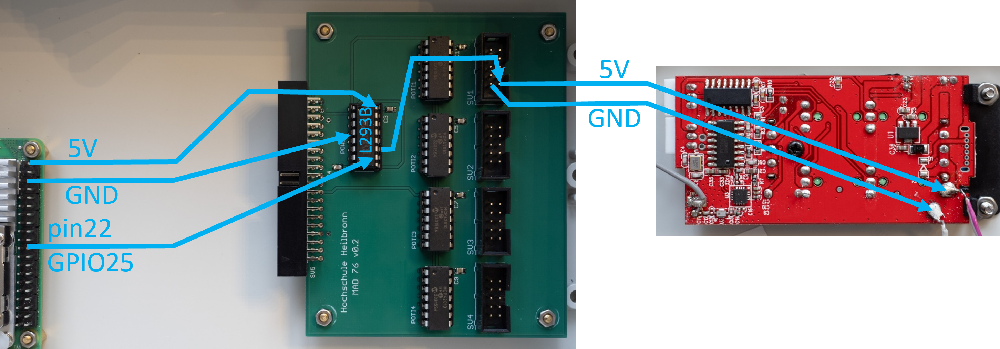
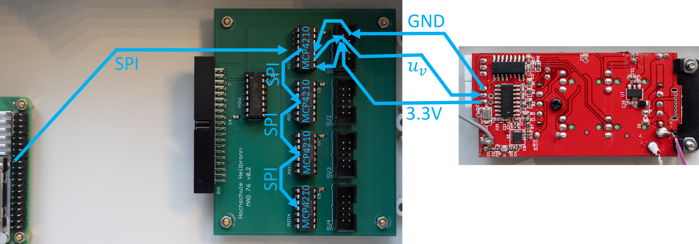
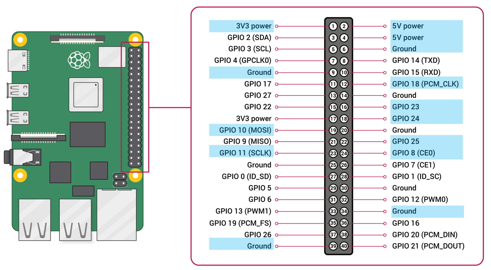
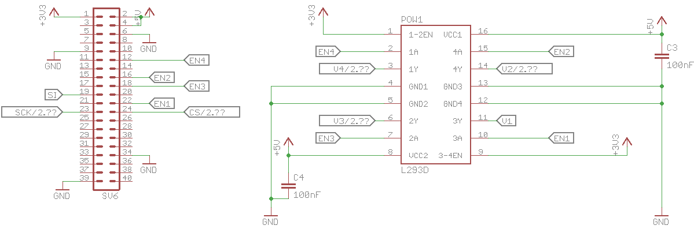
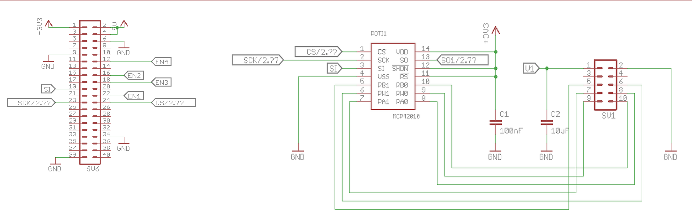
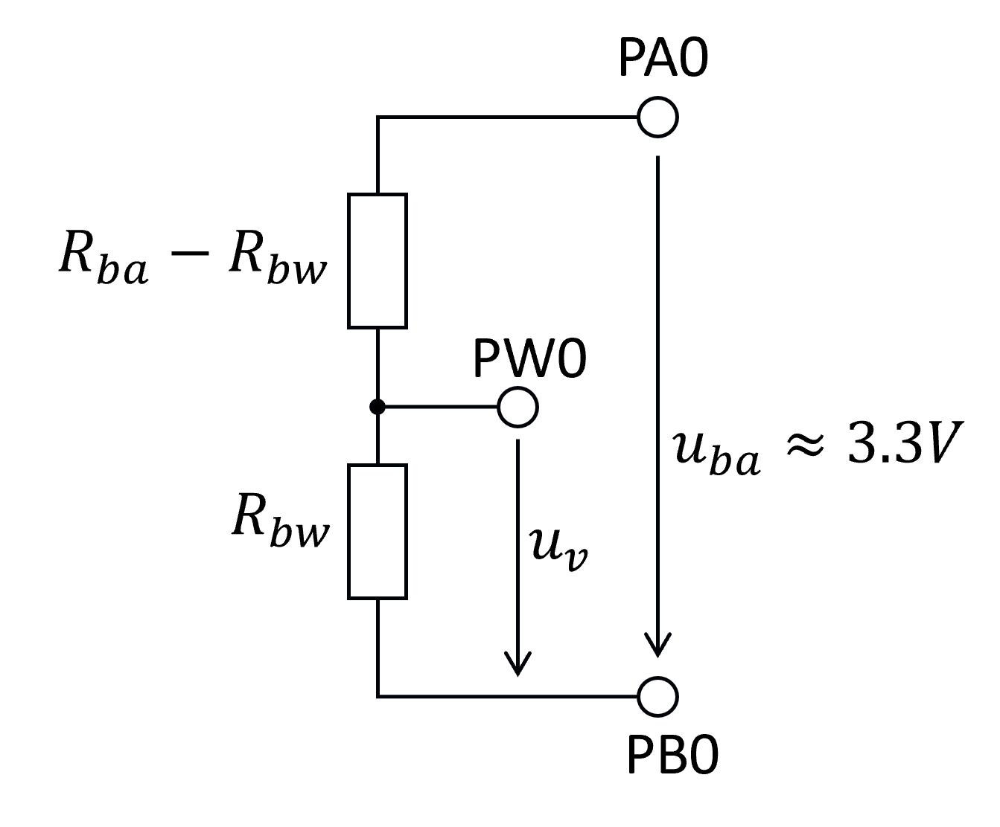
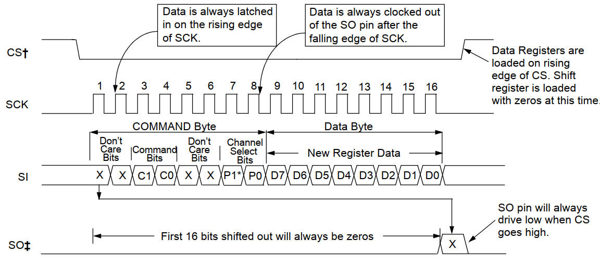

author: Frank Tränkle[^1]  
Hochschule Heilbronn, Germany
bibliography: ../lib/bib.bib
csl: ../lib/ieee.csl
link-citations: true
reference-section-title: References
title: MAD76 Academy: E. MAD76 I/O Programming

Agenda
======

-   Functional chain of MAD76 (see
    Section <a href="#functional-chain" data-reference-type="ref" data-reference="functional-chain">2</a>)

-   Power supply of remote controllers (RCs) (see
    Section <a href="#power-supply" data-reference-type="ref" data-reference="power-supply">3</a>)

-   Potentiometer emulation for RCs (see
    Section <a href="#digital-potentiometers" data-reference-type="ref" data-reference="digital-potentiometers">4</a>)

#### Teaching Objectives

-   Understand the function of remote controllers (RC) in MAD76

-   Understand the General-Purpose-I/O (GPIO) of Raspberry Pi

-   Understand power switches L293B

-   Understand digital potis MCP42010s and voltage dividers

-   Understand Serial-Peripheral-Interface (SPI) to control peripheral
    ICs

-   Learn more about Python coding

    -   digital output

    -   command line arguments parsing

    -   for-loops

    -   SPI programming

-   Measure voltages and resistances with a multimeter

Functional Chain
================

#### Agenda

-   Remote controllers (RCs) (see
    Section <a href="#remote-controllers-rcs" data-reference-type="ref" data-reference="remote-controllers-rcs">2.1</a>)

-   Functional chain from RPi over MAD76 IO to RCs (see
    Section <a href="#functional" data-reference-type="ref" data-reference="functional">2.2</a>)

-   Digital I/O of RPi (see
    Section <a href="#rpi-io" data-reference-type="ref" data-reference="rpi-io">2.3</a>)

Remote Controllers (RCs)
------------------------


-   Each individual car is controlled by one individual RC over 2.4GHz
    radio channels

Each RC has the following connectors (which will be connected to MAD76
IO):

-   Power supply

    | pin | in/out | SV1 pin | L293B  | function                                                                                     |
    |:----|:-------|:--------|:-------|:---------------------------------------------------------------------------------------------|
    | 5V  | in     | 1       | 3Y     | 5V power supply for microcontroller (C) and radio controller of RC (originally from battery) |
    | GND | in     | 2       | GND1-4 | ground                                                                                       |

-   Lower connector for motor control (thrust and braking)

    | pin                | in/out | SV1 pin | MCP42010 | function                                                          |
    |:-------------------|:-------|:--------|:---------|:------------------------------------------------------------------|
    | 3V3                | out    | 8       | PA0      | 3.3V power supply for digital poti                                |
    | Digital poti wiper | in     | 9       | PW0      | motor signal $u_v \in \left[ 0V, 3.3V \right]$ read in by C of RC |
    | GND                | out    | 10      | PB0      | ground for digital poti                                           |

    | $u_v$              | function                                 |
    |:-------------------|:-----------------------------------------|
    | $1.65V = 3.3V / 2$ | neutral position (no thrust, no braking) |
    | $0V$               | full braking / reverse thrust            |
    | $3.3V$             | full forward thrust                      |

-   Upper connector for steering control

    | pin                | in/out | SV1 pin | MCP42010 | function                                                                  |
    |:-------------------|:-------|:--------|:---------|:--------------------------------------------------------------------------|
    | 3V3                | out    | 5       | PA1      | 3.3V power supply for digital poti                                        |
    | Digital poti wiper | in     | 6       | PW1      | steering signal $\delta_v \in \left[ 0V, 3.3V \right]$ read in by C of RC |
    | GND                | out    | 7       | PB1      | ground for digital poti                                                   |

    | $\delta_v$         | function                            |
    |:-------------------|:------------------------------------|
    | $1.65V = 3.3V / 2$ | neutral position (straight driving) |
    | $0V$               | full right cornering                |
    | $3.3V$             | full left cornering                 |

Functional Chain from RPi over MAD76 IO to RCs [functional]
----------------------------------------------


-   Python or C++ code running on RPi CPU controls a car by

    -   switching on/off the power supply of the RC

    -   manipulating motor signal for thrust and braking

    -   manipulating steering signal



-   MAD76 IO can switch RCs on and off by power switch L293B

    -   L293B originally is a DC motor driver (max. 36V, 1A)

    -   L293B has 4 power switches (5V), one for each RC

-   Boot sequence of system must be

    1.  Power off RC

    2.  Switch on car

    3.  Power on RC

    4.  Onboard Cs of RC and car auto-calibrate steering and motor as
        soon as radio connection is established

-   RPi controls L293B by digital outputs

    -   e.g., GPIO25 for RC 1



-   MAD76 IO emulates 8 potentiometers for 4 RCs by 4 MCP42010s

    -   One MCP42010 per each RC and car

        -   1 digital poti for motor (PA0, PW0, PB0)

        -   1 digital poti for steering (PA1, PW1, PB1)

    -   RPi controls MCP42010 by Serial-Peripheral-Interface (SPI)

    -   MCP42010s are daisy-chained by SPI

Digital I/O of Raspberry Pi [rpi-io]
---------------------------



-   Some general-purpose input/output (GPIO) pins have multiple and
    alternative functions

-   List the current GPIO pin configuration and their assigned functions

    ```
    lab01@madp02:~ $ gpio readall  
     +-----+-----+---------+------+---+---Pi 5---+---+------+---------+-----+-----+
     | BCM | wPi |   Name  | Mode | V | Physical | V | Mode | Name    | wPi | BCM |
     +-----+-----+---------+------+---+----++----+---+------+---------+-----+-----+
     |     |     |    3.3v |      |   |  1 || 2  |   |      | 5v      |     |     |
     |   2 |   8 |   SDA.1 |   -  | 0 |  3 || 4  |   |      | 5v      |     |     |
     |   3 |   9 |   SCL.1 |   -  | 0 |  5 || 6  |   |      | 0v      |     |     |
     |   4 |   7 | GPIO. 7 |   -  | 0 |  7 || 8  | 0 |  -   | TxD     | 15  | 14  |
     |     |     |      0v |      |   |  9 || 10 | 0 |  -   | RxD     | 16  | 15  |
     |  17 |   0 | GPIO. 0 |   -  | 0 | 11 || 12 | 0 | OUT  | GPIO. 1 | 1   | 18  |
     |  27 |   2 | GPIO. 2 |   -  | 0 | 13 || 14 |   |      | 0v      |     |     |
     |  22 |   3 | GPIO. 3 |   -  | 0 | 15 || 16 | 0 | OUT  | GPIO. 4 | 4   | 23  |
     |     |     |    3.3v |      |   | 17 || 18 | 0 | OUT  | GPIO. 5 | 5   | 24  |
     |  10 |  12 |    MOSI | ALT0 | 0 | 19 || 20 |   |      | 0v      |     |     |
     |   9 |  13 |    MISO | ALT0 | 0 | 21 || 22 | 0 | OUT  | GPIO. 6 | 6   | 25  |
     |  11 |  14 |    SCLK | ALT0 | 0 | 23 || 24 | 1 | OUT  | CE0     | 10  | 8   |
     |     |     |      0v |      |   | 25 || 26 | 1 | OUT  | CE1     | 11  | 7   |
     |   0 |  30 |   SDA.0 |   IN | 1 | 27 || 28 | 1 | IN   | SCL.0   | 31  | 1   |
     |   5 |  21 | GPIO.21 |   -  | 0 | 29 || 30 |   |      | 0v      |     |     |
     |   6 |  22 | GPIO.22 |   -  | 0 | 31 || 32 | 0 |  -   | GPIO.26 | 26  | 12  |
     |  13 |  23 | GPIO.23 |   -  | 0 | 33 || 34 |   |      | 0v      |     |     |
     |  19 |  24 | GPIO.24 |   -  | 0 | 35 || 36 | 0 |  -   | GPIO.27 | 27  | 16  |
     |  26 |  25 | GPIO.25 |   -  | 0 | 37 || 38 | 0 |  -   | GPIO.28 | 28  | 20  |
     |     |     |      0v |      |   | 39 || 40 | 0 |  -   | GPIO.29 | 29  | 21  |
     +-----+-----+---------+------+---+----++----+---+------+---------+-----+-----+
     | BCM | wPi |   Name  | Mode | V | Physical | V | Mode | Name    | wPi | BCM |
     +-----+-----+---------+------+---+---Pi 5---+---+------+---------+-----+-----+
    ```

-   Many programming libraries and tools are available to do GPIO and
    SPI on RPi

-   We use

    -   Python package `RPi.GPIO` (version `python3-rpi-lgpio` for RPi
        Zero and RPi 5)

    -   Python package `spidev` for SPI

Power Supply
============

#### Agenda

-   Driver L293B (see
    Section <a href="#driver-l293b" data-reference-type="ref" data-reference="driver-l293b">3.1</a>)

-   Python code to power RC 1 (see
    Section <a href="#python-code-to-power-on-rc-1" data-reference-type="ref" data-reference="python-code-to-power-on-rc-1">3.2</a>)

-   Python code to switch on / off any RC (see
    Section <a href="#python-code-to-power-on-any-rc" data-reference-type="ref" data-reference="python-code-to-power-on-any-rc">3.3</a>)

Driver L293B
------------



-   Datasheet: <https://www.st.com/resource/en/datasheet/l293b.pdf>

-   L293B controls the power supplies of all 4 RCs

#### L293B has the following pins

| pin | name  | in/out | function                                                              | RPi Pin | GPIO   |
|:----|:------|:-------|:----------------------------------------------------------------------|:--------|:-------|
| 1   | 1-2EN | in     | Enable power switches 1 and 2 permanently                             |         |        |
| 2   | 1A    | in     | If high then RC 4 is powered on, else if low then RC 4 is powered off | 12      | GPIO18 |
| 3   | 1Y    | out    | Power supply for RC 4, 5V if powered on, 0V if powered off            |         |        |
| 4   | GND1  | in     | ground                                                                |         |        |
| 5   | GND2  | in     | ground                                                                |         |        |
| 6   | 2Y    | out    | Power supply for RC 3, 5V if powered on, 0V if powered off            |         |        |
| 7   | 2A    | in     | If high then RC 3 is powered on, else if low then RC 3 is powered off | 18      | GPIO24 |
| 8   | VCC2  | in     | 5V power supply for L293B                                             |         |        |
| 9   | 3-4EN | in     | Enable power switches 3 and 4 permanently                             |         |        |
| 10  | 3A    | in     | If high then RC 1 is powered on, else if low then RC 1 is powered off | 22      | GPIO25 |
| 11  | 3Y    | out    | Power supply for RC 1, 5V if powered on, 0V if powered off            |         |        |
| 12  | GND4  | in     | ground                                                                |         |        |
| 13  | GND3  | in     | ground                                                                |         |        |
| 14  | 4Y    | out    | Power supply for RC 2, 5V if powered on, 0V if powered off            |         |        |
| 15  | 4A    | in     | If high then RC 2 is powered on, else if low then RC 2 is powered off | 16      | GPIO23 |
| 16  | VCC1  | in     | 5V power supply for L293B                                             |         |        |

-   RPi sets digital outputs GPIO25, GPIO23, GPIO24, GPIO18 to high or
    low to switch RC 1, 2, 3, 4 on/off

Python Code to Power On RC 1
----------------------------

-   Python package `RPi.GPIO` provides functions to control GPIO pins of
    RPi

-   The following code powers RC 1 on for 5 seconds and then powers it
    off

-   Create a new directory and a new Python module `rctestpower1.py`
    with VS Code

        cd
        mkdir -p src/madpi_ws/src/rcpi/scripts
        cd src/madpi_ws/src/rcpi/scripts
        code rctestpower1.py

-   Copy the following code into `rctestpower1.py` and run it

    ``` python
    #!/usr/bin/env python3

    import time
    import sys
    import RPi.GPIO as io

    POWER_PIN = 25 # GPIO25 (pin 22)

    if __name__ == "__main__":
        # Use GPIO BCM mode for pin numbering
        io.setmode(io.BCM)
        # Alternatively use board pin numbering
        #io.setmode(io.BOARD)

        # Configure GPIO as dital output
        io.setup(POWER_PIN, io.OUT)

        # Power on RC 1
        io.output(POWER_PIN, io.HIGH)
        time.sleep(5)

        # Power off RC 1
        io.output(POWER_PIN, io.LOW)

        # Cleanup GPIO
        io.cleanup()
        
        # exit cleanly
        sys.exit(0)
    ```

Python Code to Power On any RC
------------------------------

-   The following code may power on any of the RCs

-   Create a new Python module `rcpoweron.py`

    ``` python
    #!/usr/bin/env python3

    import sys
    import RPi.GPIO as io

    CAR_CNT = 4  # Total number of cars in RCs
    POWER_PINS = [ 25, 23, 24, 18 ]

    def usage():
        """Print usage information."""
        print("Usage: python rcpoweron.py <carid>")
        print("This script tests powering on one RC on a Raspberry Pi.")

    def command_line_args():
        """Parse command line arguments."""
        # default values
        success = True
        carid = 0 # integer with arbitray wordlength
        if len(sys.argv) < 2:
            success = False
        try:
            carid = int(sys.argv[1])
            if carid < 0 or carid >= CAR_CNT:
                raise ValueError("carid must be between 0 and {}".format(CAR_CNT - 1))        
        except (ValueError, IndexError):
            success = False
        return success, carid


    if __name__ == "__main__":
        [ success, carid ] = command_line_args()
        if not success:
            usage()
            sys.exit(1)
        
        # Use GPIO BCM mode
        io.setmode(io.BCM)

        # Configure GPIO as dital output
        io.setup(POWER_PINS[carid], io.OUT)

        # Power on RC 1
        io.output(POWER_PINS[carid], io.HIGH)

        # Cleanup GPIO
        #io.cleanup()
        
        # exit cleanly
        sys.exit(0)
    ```

-   `rcpoweron.py` parses the command line and has the following command
    line argument

    | argument | description                                        |
    |:---------|:---------------------------------------------------|
    | `carid`  | zero-based ID of the RC to power on (0, 1, 2 or 3) |

-   e.g., RC 1 (one-based, `carid==0`) is powered on by entering the
    following command in a terminal

        python rcpoweron.py 0

-   e.g., RC 2 (one-based, `carid==1`) is powered on by

        python rcpoweron.py 1

### Exercises

1.  Program `rcpoweroff.py` to power off all 4 RCs at once.

    -   You may use the Python command `for` and the Python function
        `range()` to program a for-loop.

    Required results are:

    -   Python code `rcpoweroff.py`

2.  Measure the voltage at the power supply of RC 1 with a multimeter
    (see
    Figure <a href="#F-measpowervolt" data-reference-type="ref" data-reference="F-measpowervolt">1</a>)

    -   Disconnect RC 1 from socket SV 1

    -   Run `rcpoweron.py 0`

    -   Measure the voltage between pins 13 and 11 of L293B

    -   Run `rcpoweroff.py`

    -   Repeat the measurement

    -   Connect RC 1 to socket SV 1

    -   Check if blue LED switches with power

    No results need to be documented for this exercise.

<figure>
<figcaption>Exercise 2: Measure power supply voltage</figcaption>
</figure>

Digital Potentiometers
======================

#### Agenda

-   Digital Potentiometers MCP42010 (see
    Section <a href="#digital-potentiometers-mcp42010" data-reference-type="ref" data-reference="digital-potentiometers-mcp42010">4.1</a>)

-   Serial-Peripheral-Interface (SPI) (see
    Section <a href="#serial-peripheral-interface-spi" data-reference-type="ref" data-reference="serial-peripheral-interface-spi">4.2</a>)

-   SPI for MCP42010 (see
    Section <a href="#spi-for-mcp42010" data-reference-type="ref" data-reference="spi-for-mcp42010">4.3</a>)

-   Python library to control RC (see
    Section <a href="#python-library-to-control-rc" data-reference-type="ref" data-reference="python-library-to-control-rc">4.4</a>)

Digital Potentiometers MCP42010
-------------------------------

<figure>
<figcaption>MAD76 IO schematics for digital poti MCP42010 <span class="citation" data-cites="mcp42010-datasheet">[<a href="#ref-mcp42010-datasheet" role="doc-biblioref">1</a>]</span></figcaption>
</figure>

-   MCP42010 emulates 2 potentiometers by resistor cascades

#### MCP42010 has the following pins

| pin | name                     | in/out | function                                                                | RPi Pin | GPIO |
|:----|:-------------------------|:-------|:------------------------------------------------------------------------|:--------|:-----|
| 1   | $\overline{\text{CS}}$   | in     | SPI chipselect (active low)                                             | 24      |      |
| 2   | SCK                      | in     | SPI serial clock                                                        | 23      |      |
| 3   | SI                       | in     | SPI MOSI (master-out slave-in)                                          | 19      |      |
| 4   | VSS                      | in     | ground                                                                  |         |      |
| 5   | PB1                      | in     | ground for poti 1 from RC                                               |         |      |
| 6   | PW1                      | out    | poti 1 wiper for steering signal $\delta_v \in \left[ 0V, 3.3V \right]$ |         |      |
| 7   | PA1                      | in     | 3.3V supply for poti 1 from RC                                          |         |      |
| 8   | PA0                      | in     | 3.3V supply for poti 0 from RC                                          |         |      |
| 9   | PW0                      | out    | poti 0 wiper for motor signal $u_v \in \left[ 0V, 3.3V \right]$         |         |      |
| 10  | PB0                      | in     | ground for poti 0 from RC                                               |         |      |
| 11  | $\overline{\text{RS}}$   | in     | HW reset (active low), always high $\leadsto$ newer reset               |         |      |
| 12  | $\overline{\text{SHDN}}$ | in     | HW shutdown (active low), always high $\leadsto$ newer shutdown         |         |      |
| 13  | SO                       | out    | SPI MISO (master-in slave-out) for daisy-chaining 4 MCP42010s           |         |      |
| 14  | VDD                      | in     | 3.3V power supply for MCP42010                                          |         |      |

-   RPi sets poti resistor values by SPI communication (pins
    $\overline{\text{CS}}$, SCK, MOSI)

#### MCP42010 contains 2 voltage dividers

-   Input (PA0, PB0): power supply generated by RC
    $u_{ba} \approx 3.3\mathrm{V}$

-   Output (PW0): motor signal voltage
   

$$
u_v = \frac{R_{bw}}{R_{ba}} \cdot u_{ba} = \frac{R_{bw}}{10\mathrm{k\Omega}} \cdot 3.3\mathrm{V}
          \in \left[ 0\texttt{V}, 3.3\texttt{V} \right] \label{E-uv}
$$


-   Input (SCK, SI): SPI sets integer values for wiper potentiometer
   

$$
u_q \in \{0,1,...,255\}
$$

   

$$
R_{bw} = \frac{R_{ba}}{255} \cdot u_q \in \left[ 0\mathrm{k\Omega}, 10\mathrm{k\Omega} \right] \label{E-rbw}
$$


-   Resulting wiper voltage:
    (<a href="#E-rbw" data-reference-type="ref" data-reference="E-rbw">[E-rbw]</a>)
    in
    (<a href="#E-uv" data-reference-type="ref" data-reference="E-uv">[E-uv]</a>)
   

$$
u_v = \frac{u_{ba}}{255} \cdot u_q = \frac{3.3\mathrm{V}}{255} \cdot u_q
          \in \left[ 0\texttt{V}, 3.3\texttt{V} \right] \label{E-motor-voltage}
$$


-   Identical second voltage divider for steering signal
   

$$
\delta_v = \frac{3.3\mathrm{V}}{255} \cdot \delta_q \in \left[ 0\mathrm{V}, 3.3\mathrm{V} \right]$$



Serial-Peripheral-Interface (SPI)
---------------------------------

-   SPI is a widely-used synchronous serial communication protocol

-   SPI is used to control peripheral integrated circuits (ICs) like
    MCP42010 or for communication between CPUs and microcontrollers

-   SPI is a synchronous serial communication protocol

-   SPI uses a master-slave architecture

    -   master = RPi

    -   slave = MCP42010

-   SPI uses 4 wires

    |                        |                                              |
    |:-----------------------|:---------------------------------------------|
    | $\overline{\text{CS}}$ | chip select (active low) for slave selection |
    | SCK                    | serial clock                                 |
    | MOSI (SI)              | master-out slave-in data                     |
    | MISO (SO)              | master-in slave-out data                     |

-   SCK is clocked by the master with frequency
    $f = 1 \mathrm{MHz} \in [ 1 \mathrm{MHz}, 70 \mathrm{MHz}]$

-   Data bits are sent synchronously to SCK

-   Slave only reads data if $\overline{\text{CS}}$ is low

<figure>
<figcaption>MCP42010 SPI timing diagram. Copied from MCP42010 data sheet <span class="citation" data-cites="mcp42010-datasheet">[<a href="#ref-mcp42010-datasheet" role="doc-biblioref">1</a>]</span> Figure 5.1.</figcaption>
</figure>

SPI for MCP42010
----------------

-   MCP42010 reads in 16-bit data words consisting of two 8-bit bytes
    \[[1](#ref-mcp42010-datasheet)\]

    | command byte | resistor data byte |
    |:------------:|:------------------:|

-   Commands used by MAD76 are

    | command byte |       resistor data byte       |                                 |
    |:------------:|:------------------------------:|:--------------------------------|
    |    `0x11`    |    $u_q \in \{0,1,...,255\}$   | write data to poti 0 (motor)    |
    |    `0x12`    | $\delta_q \in \{0,1,...,255\}$ | write data to poti 1 (steering) |

-   Example

    | command byte | resistor data byte |                                                                                                                                                                                                             |
    |:------------:|:------------------:|:------------------------------------------------------------------------------------------------------------------------------------------------------------------------------------------------------------|
    |    `0x11`    |      $u_q=128$     | sets motor signal voltage $u_v = 3.3\mathrm{V} \cdot 128/255 = 1656\mathrm{mV}$, see equation (<a href="#E-motor-voltage" data-reference-type="ref" data-reference="E-motor-voltage">[E-motor-voltage]</a>) |

```{=html}
<!-- -->
```
-   4 MCP42010s can be daisy-chained by connecting the MISO of one to
    the MOSI of the next

    -   RPi sends sequences of 4 16-bit data words to this daisy chain

    -   One transmission sets the motor resistors of all 4 MCP42010s

        -   Example: `0x11 0xFF 0x11 0x80 0x11 0x20 0x11 0x10` sets the
            following motor signal voltages

            |      |        |                                                 |
            |:-----|:-------|:------------------------------------------------|
            | RC 1 | `0x10` | $3.3\mathrm{V} \cdot 16/255  = 207\mathrm{mV}$  |
            | RC 2 | `0x20` | $3.3\mathrm{V} \cdot 32/255 = 414\mathrm{mV}$   |
            | RC 3 | `0x80` | $3.3\mathrm{V} \cdot 128/255 = 1656\mathrm{mV}$ |
            | RC 4 | `0xFF` | $3.3\mathrm{V} \cdot 255/255 = 3300\mathrm{mV}$ |

    -   A further transmission sets the steering resistors of all 4
        MCP42010s

        -   Example: `0x12 0x40 0x12 0x30 0x12 0x20 0x12 0x10` sets all
            4 steering signal voltages

Python Library to Control RC
----------------------------

-   Create a new Python module `mbmadrclib.py` in directory
    `~/src/madpi_ws/src/rcpi/scripts` or you may copy existing code with
    the following commands

    ``` bash
    cd ~/src/madpi_ws/src/rcpi/scripts
    cp ~labor/src/mad76/madpi_ws/src/rcpi/scripts/mbmadrclib.py .
    ```

        #!/usr/bin/env python3

        """
        mbmadrclib.py
        -------------

        MAD76 RCLib for Raspberry Pi GPIO and SPI

        Copyright (C) 2025, Frank Traenkle, Hochschule Heilbronn
        """

        import spidev
        import RPi.GPIO as io

        CAR_CNT = 4 # number of cars
        POWER_PINS = [ 25, 23, 24, 18 ] # { GPIO25, pin22 ; GPIO23, pin16 ; GPIO24, pin18 ; GPIO18, pin12 }
        PEDALS_MAX = 1.0 # maximum pedals value
        STEERING_MAX = 1.0 # maximum steering value
        SPI_CHANNEL = 0 # SPI channel for communication with the car
        SPI_SPEED = 1000000 # SPI speed in Hz
        SPI_CMD_PEDALS = 0x11 # command to write pedals
        SPI_CMD_STEERING = 0x12 # command to write steering

        pedals_data = [ 0x00 ] * CAR_CNT * 2
        steering_data = [ 0x00 ] * CAR_CNT * 2

        def signal_to_spi_value(value, max_value):
            """Convert a signal value to an SPI value."""
            if value < -max_value or value > max_value:
                raise ValueError("Value must be between {} and {}".format(-max_value, max_value))
            return int((value + max_value) / (2.0 * max_value) * 255.0)

        def initialize_spi():
            """
            Initialize the SPI interface.

            Args:
                device (int): SPI device number (default: 0).
                speed (int): SPI speed in Hz (default: 1000000).
            
            Returns:
                spidev.SpiDev: Configured SPI device.
            """
            spi = spidev.SpiDev()
            spi.open(0, SPI_CHANNEL)
            spi.max_speed_hz = SPI_SPEED
            spi.mode = 0b00
            spi.bits_per_word = 8
            spi.lsbfirst = False
            spi.cshigh = False

            for i in range(CAR_CNT):
                pedals_data[2*i] = SPI_CMD_PEDALS
                pedals_data[2*i+1] = signal_to_spi_value(0.0, PEDALS_MAX)
                steering_data[2*i] = SPI_CMD_STEERING
                steering_data[2*i+1] = signal_to_spi_value(0.0, STEERING_MAX)
                
            return spi

        def initialize_gpio():
            """Initialize GPIO pins for power control.
            """
            io.setmode(io.BCM)
            for pin in POWER_PINS:
                io.setup(pin, io.OUT)
                io.output(pin, io.LOW)  # Set all power pins to LOW initially

        def cleanup_gpio():
            """Clean up GPIO pins.
            """
            io.cleanup()  # Reset all GPIO pins to their default state
            
        def switchon_rcpower(carid):
            """Switch on the power for the specified car.

            Args:
                carid (int): Car ID (0 to CAR_CNT-1).
            """
            if carid < 0 or carid >= CAR_CNT:
                raise ValueError(f"carid must be between 0 and {CAR_CNT - 1}")
            io.output(POWER_PINS[carid], io.HIGH)  # Set the specified power pin to HIGH

        def switchoff_rcpower(carid):
            """Switch off the power for the specified car.

            Args:
                carid (int): Car ID (0 to CAR_CNT-1).
            """
            if carid < 0 or carid >= CAR_CNT:
                raise ValueError(f"carid must be between 0 and {CAR_CNT - 1}")
            io.output(POWER_PINS[carid], io.LOW)  # Set the specified power pin to LOW

        def write_pedals(spi, carid, pedals):
            """Write pedals value to the specified car.

            Args:
                spi (spidev.SpiDev): Configured SPI device.
                carid (int): Car ID (0 to CAR_CNT-1).
                pedals (float): Pedals value (-PEDALS_MAX to PEDALS_MAX).
            """
            if carid < 0 or carid >= CAR_CNT:
                raise ValueError(f"carid must be between 0 and {CAR_CNT - 1}")
            id = CAR_CNT - carid - 1  # Reverse order for SPI communication
            pedals_data[id * 2 + 1] = signal_to_spi_value(pedals, PEDALS_MAX)
            spi.writebytes(pedals_data)

        def write_steering(spi, carid, steering):
            """Write steering value to the specified car.
            
            Args:
                spi (spidev.SpiDev): Configured SPI device.
                carid (int): Car ID (0 to CAR_CNT-1).
                steering (float): Steering value (-STEERING_MAX to STEERING_MAX).
            """
            if carid < 0 or carid >= CAR_CNT:
                raise ValueError(f"carid must be between 0 and {CAR_CNT - 1}")
            id = CAR_CNT - carid - 1  # Reverse order for SPI communication
            steering_data[id * 2 + 1] = signal_to_spi_value(steering, STEERING_MAX)
            spi.writebytes(steering_data)

-   Python library `mbmadrclib.py` provides functions

    -   to power on / off the RCs via L293B (see
        Section <a href="#power-supply" data-reference-type="ref" data-reference="power-supply">3</a>)

    -   to set the motor and steering signal voltages of the RCs by
        sending SPI commands to MCP42010s

-   Function `write_pedals` sets the motor signal voltages $u_v$

    | argument | description                                                                                      |
    |:---------|:-------------------------------------------------------------------------------------------------|
    | `spi`    | SPI object of `spidev`                                                                           |
    | `carid`  | RC / car ID from 0 to 3                                                                          |
    | `pedals` | Normalized motor signal $u_n \in [-1, 1]$. -1 is full brake / reverse, 1 is full forward thrust. |

    -   `write_pedals` limits $u_n$ to the range $[-1, 1]$ which is an
        important *safety measure*

    -   `write_pedals` computes the SPI value $u_q$ for the resistor
        from $u_n$

$$
u_q = 255 \cdot (u_n + 1) / 2 \in [ 0, 255]
                \label{E-resistor-spi-value}
$$
 Inserting this equation
        into equation
        (<a href="#E-motor-voltage" data-reference-type="ref" data-reference="E-motor-voltage">[E-motor-voltage]</a>)
        yields the motor signal voltage for the RC
       

$$
u_v = \frac{3.3\mathrm{V}}{255} \cdot u_q = 3.3\mathrm{V} \cdot (u_n + 1) / 2 \in [ 0, 3.3\mathrm{V} ]
                \label{E-resulting-motor-signal}
$$


-   Function `write_steering` sets the steering signal voltages
    $\delta_v$ and is similar to `write_pedals`

    | argument   | description                                                                               |
    |:-----------|:------------------------------------------------------------------------------------------|
    | `spi`      | SPI object of `spidev`                                                                    |
    | `carid`    | RC / car ID from 0 to 3                                                                   |
    | `steering` | Normalized steering signal $u_n \in [-1, 1]$. -1 is full right, 1 is full left cornering. |

-   The Python module `rctest.py` is an extension of `rcpoweron.py` from
    Section <a href="#python-poweron" data-reference-type="ref" data-reference="python-poweron">[python-poweron]</a>

    -   It uses the new library `mbmadrclib.py` to power on the RCs and
        to set the motor and steering signals

    -   It provides a simple command line interface to control the RCs

-   Create Python module `rctest.py` in directory
    `~/src/madpi_ws/src/rcpi/scripts` or copy existing `rctest.py` with
    the following commands

        cd ~/src/madpi_ws/src/rcpi/scripts
        cp ~labor/src/mad76/madpi_ws/src/rcpi/scripts/rctest.py .

    ``` python
    #!/usr/bin/env python3

    """
    rctest.py
    ---------

    Script to test the GPIO pins on a Raspberry Pi.

    Copyright (C) 2025, Frank Traenkle, Hochschule Heilbronn
    """

    import time
    import sys
    import signal
    import mbmadrclib as rc

    # This script is used to test the GPIO pins on a Raspberry Pi.


    def signal_handler(signal, frame):
        """Handle the signal to clean up GPIO on exit."""
        rc.cleanup_gpio()
        sys.exit(0)

    def usage():
        """Print usage information."""
        print("Usage: python rctest.py <carid> <pedals> <delta>")
        print("This script tests the GPIO pins on a Raspberry Pi.")
        
    def command_line_args():
        """Parse command line arguments."""
        # default values
        success = True
        carid = 0 # integer with arbitray wordlength
        pedals = 0.0 # 64bit float
        steering = 0.0
        if len(sys.argv) < 3:
            success = False
        try:
            carid = int(sys.argv[1])
            if carid < 0 or carid >= rc.CAR_CNT:
                raise ValueError("carid must be between 0 and {}".format(rc.CAR_CNT - 1))
            pedals = float(sys.argv[2])
            if pedals < -rc.PEDALS_MAX or pedals > rc.PEDALS_MAX:
                raise ValueError("pedals must be between {} and {}".format(-rc.PEDALS_MAX, rc.PEDALS_MAX))
            steering = float(sys.argv[3])
            if steering < -rc.STEERING_MAX or steering > rc.STEERING_MAX:
                raise ValueError("steering must be between {} and {}".format(-rc.STEERING_MAX, rc.STEERING_MAX))        
        except (ValueError, IndexError):
            success = False
        return success, carid, pedals, steering


    if __name__ == "__main__":
        [ success, carid, pedals, steering ] = command_line_args()
        if not success:
            usage()
            sys.exit(1)
        
        # initialize signal handling
        signal.signal(signal.SIGINT, signal_handler)
        signal.signal(signal.SIGTERM, signal_handler)

        # initialize SPI
        spi = rc.initialize_spi()
        if not spi:
            print("Failed to initialize SPI.")
            sys.exit(1)
        
        # initialize GPIO
        rc.initialize_gpio()

        # switch on power for the specified car
        rc.switchon_rcpower(carid)

        # wait for a short time to ensure power is stable
        time.sleep(1)
        
        # write pedals
        rc.write_pedals(spi, carid, pedals)
        
        # # write pedals
        rc.write_steering(spi, carid, steering)
        
        # exit cleanly
        sys.exit(0)
    ```

-   `rctest.py` parses the command line and has the following command
    line arguments

    | argument   | description                                       |
    |:-----------|:--------------------------------------------------|
    | `carid`    | ID of the RC and car (0, 1, 2 or 3)               |
    | `pedals`   | normalized motor signal $u_n \in [-1, 1]$         |
    | `steering` | normalized steering signal $\delta_n \in [-1, 1]$ |

### Exercises

1.  Measure the resistance values $R_{bw}$ of the digital potis of RC 1
    with a multimeter (see
    Figure <a href="#F-measohm" data-reference-type="ref" data-reference="F-measohm">3</a>)

    -   Disconnect RC 1 from socket SV 1 (see
        Figure <a href="#F-mcp42010-schematics" data-reference-type="ref" data-reference="F-mcp42010-schematics">2</a>)

    -   Set $u_n=0$ and $\delta_n=0$ by running

            python rctest.py 0 0.0 0.0

    -   Measure the resistance $R_{bw}$ for motor control between pins
        PB0 and PW0 of the first MCP42010 (Poti 1)

    -   Measure the resistance $R_{bw}$ for steering control between
        pins PB1 and PW1

    -   Re-run `rctest.py`, modify the pedal and steering values
        $u_n,\delta_n \in [-1, 1]$ and check if the resistance values
        match to the expected values according to equations
        (<a href="#E-rbw" data-reference-type="ref" data-reference="E-rbw">[E-rbw]</a>)
        and
        (<a href="#E-resistor-spi-value" data-reference-type="ref" data-reference="E-resistor-spi-value">[E-resistor-spi-value]</a>):
       

$$
R_{bw} = \frac{R_{ba}}{255} \cdot u_q = 10\mathrm{k\Omega} \cdot (u_n + 1) / 2 \in \left[ 0\mathrm{k\Omega}, 10\mathrm{k\Omega} \right]$$

    -   Required results are:

        -   Table with columns for $u_n$, expected
            $R_{bw} / \mathrm{\Omega}$, measured
            $R_{bw} / \mathrm{\Omega}$ and at least 3 rows for different
            $u_n$ values

2.  Measure the motor and steering signal voltages of the digital potis
    of RC 1 with a multimeter (see
    Figure <a href="#F-measvolt" data-reference-type="ref" data-reference="F-measvolt">4</a>)

    -   Connect RC 1 to socket SV 1: now the RC supplies 3.3V to
        MCP42010 on PA0 and PA1

    -   Re-run `rctest.py`, change the pedal and steering values
        $u_n,\delta_n \in [-1, 1]$

    -   Measure the motor signal voltage $u_v$ for motor control between
        pins PB0 and PW0

    -   Measure the steering signal voltage $\delta_v$ for steering
        control between pins PB1 and PW1

    -   Check the voltages match to the expected voltages according to
        equation
        (<a href="#E-resulting-motor-signal" data-reference-type="ref" data-reference="E-resulting-motor-signal">[E-resulting-motor-signal]</a>):
       

$$
u_v = 3.3\mathrm{V} \cdot (u_n + 1) / 2 \in [ 0, 3.3\mathrm{V} ]$$

    -   Required results are:

        -   Table with columns for motor signal $u_n$, expected
            $u_v / \mathrm{V}$, measured $u_v / \mathrm{V}$ and at least
            3 rows for different $u_n$ values

        -   Optional: same table for steering signals $\delta_n$ and
            $\delta_v$

3.  Calibrate the remote control according to [Remote Control Cabling
    and
    Calibration](https://github.com/modbas/mad76/blob/main/doc/remotecontrol/remotecontrol.md).
    No results need to be documented for this exercise.

<figure>
<figcaption>Exercise 1: Measure <span class="math inline"><em>R</em><sub><em>b</em><em>w</em></sub></span> with a multimeter</figcaption>
</figure>

<figure>
<figcaption>Exercise 2: Measure <span class="math inline"><em>u</em><sub><em>v</em></sub></span> with a multimeter</figcaption>
</figure>

References [bibliography]
==========

<div id="refs" class="references" markdown="1">

<div id="ref-mcp42010-datasheet" markdown="1">

\[1\] “Microchip MCP42010 Data Sheet.” 2025. Available:
<https://ww1.microchip.com/downloads/aemDocuments/documents/OTH/ProductDocuments/DataSheets/11195c.pdf>

</div>

</div>

[^1]: frank.traenkle@hs-heilbronn.de
