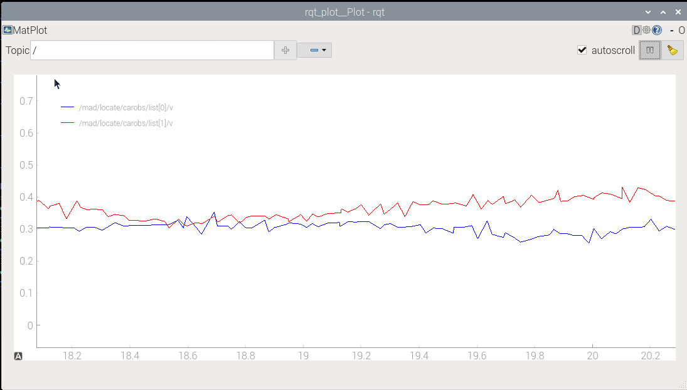

author: Frank Tränkle[^1]  
Hochschule Heilbronn, Germany
bibliography: ../lib/bib.bib
csl: ../lib/ieee.csl
link-citations: true
reference-section-title: References
title: MAD76 Academy: C. Car Race

Start and Run
=============

Driverless Race
---------------

-   After installation, remote control calibration, and computer vision
    configuration, you are now ready to race.

-   In this race, up to four cars run autonomously.

-   Optionally, one human player can assume manual control of the
    orange/red car 0 and compete against the driverless cars.

-   The lap statistics of car 0 are recorded and displayed in a web
    browser.

-   For starting the race on the real MAD76 track, open a terminal on
    the Raspberry Pi 5 and run:

    ``` bash
    ros2 launch mbmad madpislfull.launch
    ```

-   Alternatively, if you have installed MAD76 on a PC, you may start
    the race in simulation mode by running:

    ``` bash
    ros2 launch mbmad madpislsim.launch
    ```

-   Note: Never start `madpislfull.launch` or `madpislsim.launch` at the
    same time or more than once without stopping the previous instance
    first.

-   Open a new terminal, and start all cars by running:

    ``` bash
    ros2 run mbmadcar send_maneuver.py
    ```

-   The driverless cars will race against each other.

-   Whereas car id 0 (orange/red) is controlled by PI and state-space
    controllers, known from Bachelor-degree programs,

-   all other cars with ids 1 ot 3 are controlled by AI agents
    (reinforcement learning Software-Actor-Critic agents, SAC agents).

Adapt Behavior of Car Id 0
--------------------------

-   The behavior of an id car 0 can be adapted by sending maneuver
    messages.

-   Stop `send_maneuver.py` from above by hitting `Ctrl+C`.

-   All cars keep on running autonomously.

-   Send maneuver to car 0 (orange/red car)

    ``` bash
    ros2 run mbmadcar send_maneuver.py 0 0.3 0.25
    ```

    -   First argument is the car identifier

    -   Second argument is the car reference speed in
        $\mathrm{m \over s}$

    -   Third argument is the lateral reference position

        |      |                             |
        |:-----|:----------------------------|
        | 0    | right curb                  |
        | 0.25 | right lane                  |
        | 0.5  | center line                 |
        | 0.75 | left lane                   |
        | 1    | left curb                   |
        | -1   | ideal line for low laptimes |

-   The maximum speed of each car is $0.5 \mathrm{m \over s}$

-   You may stop the individual car by sending a maneuver with reference
    speed $0 \mathrm{m \over s}$

-   Reverse driving is possible by setting a negative reference speed

Human Player
------------

-   One human player may assume manual control of car 0 by powering up
    the Xbox controller.

-   Car 0 now stops automatically and waits for manual control.

-   The left vertical joystick control is for thrust, braking, and
    reversing.

-   The right horizontal joystick controls steering.

-   In slow driving, MAD76 supports the human player by stabilizing the
    car in the lane.

-   For lap statistics and ranking, open a web browser on the Raspberry
    Pi 5 and navigate to <http://localhost:8082>.

-   You may pass the control of car 0 back to autonomous driving by
    switching off the Xbox controller.

-   The lap times of car 0 are measured and displayed in the web browser
    at <http://localhost:8082>.

    -   Enter a driver name and hit `Start`

    -   Then the lap times and average lap speed are measured and
        displayed

    -   Lap times of drivers are ranked in a leaderboard

Measuring Vehicle Dynamics States
---------------------------------

-   With `rqt_plot` of ROS2, message signals can be measured and plotted
    in oscilloscopes

-   Open a new terminal and run:

    ``` bash
    ros2 run rqt_plot rqt_plot
    ```

-   In the opened window, enter the topic name with signal element name
    in the entry field and hit the button `+`

-   E.g. enter `/mad/locate/carobs/list[0]/v` to plot the speed of car 0



[^1]: frank.traenkle@hs-heilbronn.de
