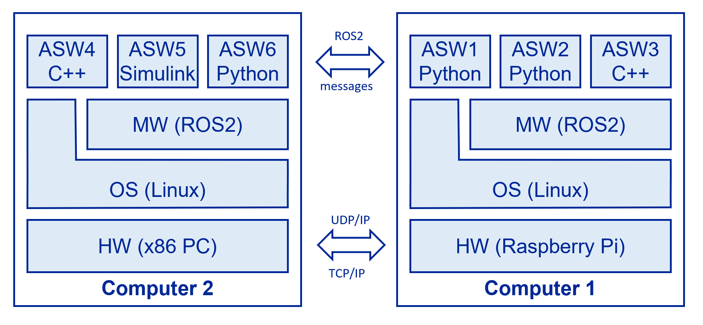
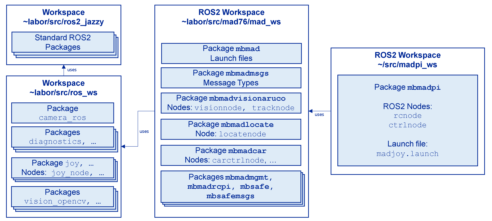
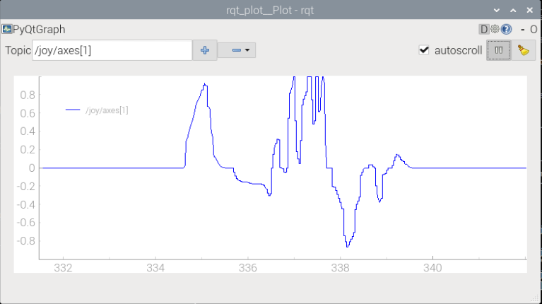
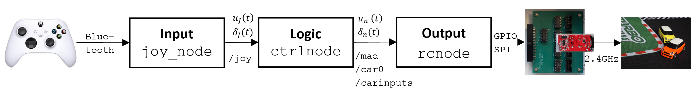
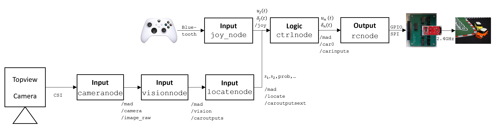

author: Frank Tränkle[^1]  
Hochschule Heilbronn, Germany
bibliography: ../lib/bib.bib
csl: ../lib/ieee.csl
link-citations: true
reference-section-title: References
title: MAD76 Academy: D. ROS2 Coding

Agenda
======

-   What is ROS? Why ROS? (see
    Section <a href="#what-is-ros" data-reference-type="ref" data-reference="what-is-ros">2</a>)

-   MAD76 and ROS2 (see
    Section <a href="#mad76-and-ros" data-reference-type="ref" data-reference="mad76-and-ros">3</a>)

-   ROS2 Joystick Input (see
    Section <a href="#ros2-joystick-input" data-reference-type="ref" data-reference="ros2-joystick-input">4</a>)

-   ROS2 Node for MAD76 IO (see
    Section <a href="#ros2-node-for-mad76-io" data-reference-type="ref" data-reference="ros2-node-for-mad76-io">5</a>)

-   Joystick Control of MAD76 (see
    Section <a href="#joystick-control-of-mad76" data-reference-type="ref" data-reference="joystick-control-of-mad76">6</a>)

#### Teaching Objectives

-   Understand middlewares (MWs) for automotive and robotics

-   Understand computer communication with MWs

-   Learn how to operate ROS2 on command line

-   Learn how to measure signals with ROS2

-   Learn how to code for ROS2 in Python

-   Learn functional chain in Control Theory / Embedded Systems and
    message-based-communication of signals

-   Run MAD76

-   Configure MAD76 computer vision

-   Program joystick control

What is ROS
===========

-   Robot Operating System (ROS) is a middleware (MW) and not an
    operating system (OS)

    -   *Middleware (MW)* = Intermediate SW between OS and application
        software (ASW)

-   ROS is a programming framework for robotics and automotive

-   ROS is for distributed computing

-   ROS is for embedded, realtime systems

    -   *Embedded* = Computer controls device (vehicle, robot, TV,
        smartphone, etc.)

    -   *Realtime* = Guaranteed response within pre-defined time
        intervals

-   ROS provides programming libraries and tools for coding in a wide
    variety of languages and environments

    -   Python, C, C++, Rust, MATLAB/Simulink, Bash, etc.



-   ROS supports the following operating systems

    -   Linux, Windows, macOS, QNX

-   ROS includes tools for measuring, simulation, visualization, and
    debugging

-   ROS is open-source and has a large community

-   ROS is for academics and industry

-   We use ROS2 Jazzy Jalisco \[[1](#ref-ros2)\], the second generation
    of ROS

Why ROS?
--------

-   ROS apps are easy to code

-   Distributed computing is straightforward

-   Apps are easy to port from one HW or OS to another

-   Communication is transparent, platform- and language-independent

-   Easy switch between simulation and real system

-   ROS provides a large set of ready-to-use libraries for robotics and
    automotive

    -   cameras, LiDAR, GPS, inertial measurement units (IMU), etc.

    -   robot arms, wheels, motors, etc.

    -   robot control, navigation, object tracking, mapping, etc.

-   ROS is easy to configure and program, compared to other middlewares
    (e.g., AUTOSAR, Robert Bosch AOS)

    -   But: standard ROS is not as safe and secure

MAD76 and ROS
=============

<figure>
<figcaption>ROS2 nodes and topics of MAD76 Driving Stack</figcaption>
</figure>

-   The MAD76 driving stack = ROS2 nodes

-   *ROS2 Node*

    -   application software component

    -   typically one Linux process

    -   communicates with other ROS2 nodes via messages and services

-   *ROS2 Topic*

    -   message-based communication channel with a unique topic name and
        a predefined message type

    -   topic name is a string

    -   topic name may be organized in hierarchies (similar to file
        paths)

    -   ROS2 uses a publish-subscribe pattern (similar to WhatsApp
        groups)

        -   multiple nodes can publish messages to the same topic

        -   multiple nodes can subscribe to the same topic and receive
            the same messages

    -   internally, ROS2 communication is implemented using Data
        Distribution Service (DDS) with TCP/IP, UDP/IP, or shared memory

-   The rectangles are *ROS2 nodes*

    | ROS2 Node      | Description                                                                                |
    |:---------------|:-------------------------------------------------------------------------------------------|
    | `camera_node`  | standard ROS2 node for RPi camera input and image acquisition \[[2](#ref-ros-cameranode)\] |
    | `joy_node`     | standard ROS2 node for joystick input \[[3](#ref-ros-joy)\] (will be used in this session) |
    | `visionnode`   | computer vision based on AruCo markers                                                     |
    | `locatenode`   | multi-object tracking                                                                      |
    | `carctrlnode`  | speed control, position control, pathfollowing control, racing                             |
    | `rcnode`       | controls cars via MAD76 IO (will be developed in this session)                             |
    | `tracknode`    | stores map of MAD76 map                                                                    |
    | `sendmaneuver` | generates maneuvers for cars                                                               |

-   The single-pointed arrows are *ROS2 topics*

    | ROS2 Topic                  | ROS2 Message Type                 | Description                                      |
    |:----------------------------|:----------------------------------|:-------------------------------------------------|
    | `/mad/camera/image_raw`     | `sensor_msgs.msg.Image`           | camera frames with sampling time $25\mathrm{ms}$ |
    | `/mad/vision/caroutputs`    | `mbmadmsgs.msg.CarOutputsList`    | list of car poses                                |
    | `/mad/locate/caroutputsext` | `mbmadmsgs.msg.CarOutputsExtList` | list of car poses including velocities           |
    | `/mad/car?/carinputs`       | `mbmadmsgs.msg.CarInputs`         | control signals for each individual car          |
    | `/mad/car?/maneuver`        | `mbmadmsgs.msg.DriveManeuver`     | maneuvers for path following and parking         |
    | `/mad/car?/joy`             | `sensor_msgs.msg.Joy`             | standard ROS2 joystick messages                  |

-   The double-pointed arrow is a *ROS2 service*

    -   A service is similar to a function call

    -   But across process boundaries

    -   A service can have a request and a response (similar to function
        arguments and return values)

ROS2 Workspaces and Packages
----------------------------

-   ROS2 is for *component-based SW engineering*

    -   SW is engineered in teams or world-wide

    -   Individual SW engineers develop individual SW components in
        teams

    -   With reducing the number of team conflicts

-   ROS2 organizes SW in ROS2 workspaces and ROS2 packages

    -   *ROS2 workspaces* consist of ROS2 packages

    -   *ROS2 packages* contain

        -   ROS2 nodes

        -   Message and service type definitions

        -   Launch files

    -   ROS2 workspaces may depend on each other

    -   ROS2 packages may depend on each other



### Exercises

1.  Start the MAD76 software stack and adjust the Raspberry Pi camera
    according to Sections *Mounting Camera* and *Focus and Aperture* in
    user manual [Computer Vision
    Configuration](https://github.com/modbas/mad76/blob/main/doc/vision/vision.md).
    Required results are:

    -   The computer vision of MAD76 shall detect all 4 frame markers
        with high reliability and no interrupts

    -   The computer vision shall detect the car markers at any position
        on the track with high reliability and no interrupts

    -   Smartphone or screencast video file which demonstrates this
        reliability in computer vision

    -   This video file shall be readable by the VLC media player

2.  Start MAD76 car race according to user manual [Car
    Race](https://github.com/modbas/mad76/blob/main/doc/race/race.md).

ROS2 Joystick Input
===================

#### Agenda

-   Start ROS2 joystick node (see
    Section <a href="#start-ros2-joystick-node" data-reference-type="ref" data-reference="start-ros2-joystick-node">4.1</a>)

-   Measure ROS2 joystick messages (see
    Section <a href="#measure-ros2-joystick-messages" data-reference-type="ref" data-reference="measure-ros2-joystick-messages">4.2</a>)

Start ROS2 Joystick Node
------------------------

-   ROS2 nodes are started using the command

    ``` bash
    ros2 run <package> <node>
    ```

    |           |                                                                                       |
    |:----------|:--------------------------------------------------------------------------------------|
    | `package` | ROS2 package (packages contain nodes, message types, etc. and have unique namespaces) |
    | `node`    | ROS2 node (binary)                                                                    |

-   The following ROS2 command starts ROS2 node `joy_node` from
    ROS2package `joy`

    ``` bash
    ros2 run joy joy_node
    ```

    -   ROS2 package `joy` is available from standard ROS2 workspace
        `~labor/src/ros_ws`

    -   ROS2 node `joy_node` accesses joystick via Linux Joystick API

    -   `joy_node` reads in all joystick axes and button values

    -   `joy_node` publishes joystick input as ROS2 messages to the ROS2
        topic `/joy`

-   List all running nodes

    ``` bash
    ros2 node list
    ```

-   List all available topics

    ``` bash
    ros2 topic list
    ```

Measure ROS2 Joystick Messages
------------------------------

-   ROS2 messages can be measured by using the command

    ``` bash
    ros2 topic echo <topic>
    ```

    |         |                                                                                    |
    |:--------|:-----------------------------------------------------------------------------------|
    | `topic` | Topic to be subscribed to. All messages published to this topic will be displayed. |

-   Open a new terminal and measure joystick messages on topic `/joy`

    ``` bash
    ros2 topic echo /joy
    ```

-   Make sure that the joystick is powered on and connected to bluetooth
    according to <https://pimylifeup.com/xbox-controllers-raspberry-pi/>

-   Move the joystick levers and push buttons $\leadsto$ message output
    is changing accordingly

-   The following command shows the frequency of joystick messages

    ``` bash
    ros2 topic hz /joy
    ```

#### ROS2 Message Types

-   ROS2 node `joy_node` publishes ROS2 messages of type
    `sensor_msgs.msg.Joy` on ROS2 topic `/joy`

-   Message types in ROS2 are defined in `.msg` files

-   You can view the definition of the message type
    `sensor_msgs.msg.Joy` by entering

    ``` bash
    ros2 interface show sensor_msgs/msg/Joy
    ```

-   or by

    ``` bash
    less ~labor/src/ros2_jazzy/install/sensor_msgs/share/sensor_msgs/msg/Joy.msg
    ```

-   The message type `sensor_msgs::msg::Joy` has the following fields

    | Field Name | ROS2 Type               | Description                                                 |
    |:-----------|:------------------------|:------------------------------------------------------------|
    | `header`   | `std_msgs::msg::Header` | Standard message header containing timestamp in nanoseconds |
    | `axes`     | `float32[]`             | Joystick axes values                                        |
    | `buttons`  | `int32[]`               | Joystick button states                                      |

#### Signals

-   *Signals* are a key mathematical concept in *Control Theory* (3rd
    semester at university)

-   Joystick axes and button values are *signals*

-   Signals are measurement values with a time axis

-   A signal $f$ can be expressed as a mathematical function of time:
    $f: t \mapsto f(t)$

-   Example: signal function $u_J(t)$ for the vertical axis of the left
    joystick lever

    -   we will us $u_J(t)$ to control the car via MAD76 IO

-   Signals can be graphically displayed in signal-time-diagrams

-   Signals may be encoded in messages

-   ROS2 provides tools for visualizing and analyzing these signals

-   Standard ROS2 node `rqt_plot` can be used to plot the signals in a
    realtime signal-time-diagram

    ``` bash
    ros2 run rqt_plot rqt_plot
    ```

```{=html}
<!-- -->
```
-   Enter `/joy/axes[1]` in the entry field `Topic` to plot $u_J(t)$

    |         |                                                    |
    |:--------|:---------------------------------------------------|
    | `/joy`  | topic name                                         |
    | `/axes` | field `axes` of message type `sensor_msgs.msg.Joy` |
    | `[1]`   | zero-based index of the joystick axis              |

-   The x-axis in this signal-time-diagram is the time axis $t$ in
    seconds

-   The y-axis is the value axis $u_J \in [-1, 1]$ of signal function
    $u_J(t)$

-   You may zoom the plot using the mouse wheel or the right mouse
    button with horizontal or vertical drag

-   You may move the plot using the left mouse button



ROS2 Node for MAD76 IO
======================

#### Agenda

-   Create a new ROS2 workspace and package for MAD76 IO (see
    Section <a href="#ros2-workspace-and-package-for-mad76-io" data-reference-type="ref" data-reference="ros2-workspace-and-package-for-mad76-io">5.1</a>)

-   Create and run ROS2 node for MAD76 IO power and potis (see
    Section <a href="#code-and-run-ros2-node" data-reference-type="ref" data-reference="code-and-run-ros2-node">5.2</a>)

ROS2 Workspace and Package for MAD76 IO
---------------------------------------

-   Create

    -   a new ROS2 workspace `~/src/madpi_ws`

    -   a new ROS2 package `mbmadpi` in this ROS2 workspace

    -   a new ROS2 node `rcnode` in this ROS2 package

    ```{=html}
    <!-- -->
    ```
    ``` bash
    cd ~/src/madpi_ws/src
    ros2 pkg create --node-name=rcnode --build-type=ament_python mbmadpi
    ```

-   Build this workspace and make it available in ROS2

    ``` bash
    cd ~/src/madpi_ws
    colcon build --symlink-install
    source install/setup.bash
    ```

    -   **IMPORTANT:** The build command `colcon` must be executed in
        ROS2 workspace directory `~/src/madpi_ws` and nowhere else

    -   `colcon` builds all ROS2 packages in this workspace

    -   `source install/setup.bash` runs the Bash script `setup.bash`
        which

        -   sets up the environment for the workspace

        -   makes the ROS2 packages, nodes, etc. available in ROS2
            commands, e.g., `ros2 run`

```{=html}
<!-- -->
```
-   Edit the initialization Bash script `~/.bashrc` so that the ROS2
    environment is always available in all terminals

    -   Open file `~/.bashrc` in VS Code

    -   Add the following line at the end of the file

        ``` bash
        source ~/src/madpi_ws/install/setup.bash
        ```

-   Run the new ROS2 node `rcnode` of the new ROS package `mbmadpi`

    ``` bash
    ros2 run mbmadpi rcnode
    ```

    -   The above command `ros2 pkg create` has automatically created a
        simple Python module `rcnode.py` which prints a "Hello world"
        message

    -   We will now modify this module for doing real MAD76 IO

Code and Run ROS2 Node
----------------------

#### Coding ROS2 Node `rcnode`

-   The new ROS2 node `rcnode` will control the MAD76 IO by digital
    output and SPI in the same way as Python module `rctest.py` from
    learning session [MAD76 I/O
    Programming](../teachmad76io/teachmad76io.md)

-   It will re-use the Python library `mbmadrclib.py` from learning
    session [MAD76 I/O Programming](../teachmad76io/teachmad76io.md)

-   Copy `mbmadrclib.py` to the new ROS2 package `mbmadpi`

    ``` bash
    cd ~/src/madpi_ws
    cp ~labor/src/mad76/madpi_ws/src/rcpi/scripts/mbmadrclib.py src/mbmadpi/mbmadpi
    ```

-   Open ROS2 workspace `~/src/madpi_ws` in VS Code

    ``` bash
    code .
    ```

-   Open file `src/mbmadpi/mbmadpi/rcnode.py` in VS Code

-   Modify file `rcnode.py` as follows or copy an already existing
    version with the following command

    ``` bash
    cp ~labor/src/mad76/madpi_ws/src/mbmadpi/mbmadpi/rcnode.py src/mbmadpi/mbmadpi
    ```

        #!/usr/bin/env python3

        """
        rcnode.py
        ---------

        ROS2 Node to remotely control MAD76 cars

        Copyright (C) 2025, Frank Traenkle, Hochschule Heilbronn
        """

        import sys
        import rclpy
        import rclpy.node
        import mbmadmsgs.msg
        try:
            import mbmadpi.mbmadrclib as rc
        except ImportError:
            import mbmadrclib as rc
        try:
            import mbmadpi.carparameters as p
        except ImportError:
            import carparameters as p

        class RcNode(rclpy.node.Node):
            """
            RcNode is a ROS2 Node to remotely control MAD76 cars.
            """
            
            def __init__(self):
                """
                RcNode constructor."""
                super().__init__('rcnode', namespace='/mad')

            def init(self):
                """ Initialize the RcNode.
                
                Returns:
                    bool: True if initialization was successful, False otherwise.
                """
                self.carid = 0
                self.spi = rc.initialize_spi()
                if not self.spi:
                    self.get_logger().info("Failed to initialize SPI.")
                    return False
                
                # initialize GPIO
                rc.initialize_gpio()

                # switch on power for the specified car
                rc.switchon_rcpower(self.carid)

                qosBestEffort = rclpy.qos.QoSProfile(
                  reliability = rclpy.qos.QoSReliabilityPolicy.BEST_EFFORT,
                  durability = rclpy.qos.QoSDurabilityPolicy.VOLATILE,
                  history = rclpy.qos.QoSHistoryPolicy.KEEP_LAST,
                  depth=1)
                qosReliable = rclpy.qos.QoSProfile(
                  reliability = rclpy.qos.QoSReliabilityPolicy.RELIABLE,
                  durability = rclpy.qos.QoSDurabilityPolicy.VOLATILE,
                  history = rclpy.qos.QoSHistoryPolicy.KEEP_LAST,
                  depth=1)
                self.sub_carinputs = self.create_subscription(
                    mbmadmsgs.msg.CarInputs,
                    f'/mad/car{self.carid}/carinputs',
                    self.carinputs_callback,
                    qosBestEffort
                )
                
                return True
                
                
            def spin(self):
                """ Spin the RcNode to process incoming messages."""
                rclpy.spin(self.node)

            def destroy(self):
                """ Clean up resources and shutdown the RcNode."""
                self.destroy_node()
                
            def carinputs_callback(self, msg):
                """ Callback function for car inputs messages.

                Args:
                    msg (mbmadmsgs.msg.CarInputs): The CarInputs message containing carid, pedals, and steering.
                """
                #self.get_logger().info(f'CarInputs msg received: carid={msg.carid}, pedals={msg.pedals}, steering={msg.steering}')

                # saturate pedals
                pedals = msg.pedals
                if pedals > p.P_UN_MAX:
                    pedals = p.P_UN_MAX
                elif pedals < -p.P_UN_MAX:
                    pedals = -p.P_UN_MAX
                
                # saturate steering
                steering = msg.steering
                if steering > p.P_DELTAN_MAX:
                    steering = p.P_DELTAN_MAX
                elif steering < -p.P_DELTAN_MAX:
                    steering = -p.P_DELTAN_MAX

                # SPI output
                rc.write_pedals(self.spi, self.carid, pedals)
                rc.write_steering(self.spi, self.carid, steering)
                
        def main():
            """ Main function to initialize and run the RcNode."""
            ret = 0
            rclpy.init(args=sys.argv)
            node = RcNode()
            if not node.init():
                node.get_logger().info("Initialization failed, shutting down.")
                ret = 1
            else:
                rclpy.spin(node)
                node.destroy_node()
                rclpy.shutdown()
            sys.exit(ret)

        if __name__ == '__main__':
            main()

-   `rcnode.py` depends on `carparameters.py`

-   Create Python module `carparameters.py` in the same directory as
    `rcnode.py` with the following content (or copy it from
    `~labor/src/mad76/madpi_ws/src/mbmadpi/mbmadpi/carparameters.py`)

    ``` python
    #!/usr/bin/env python3

    """
    carparameters.py
    ----------------

    MAD76 car parameters

    Copyright (C) 2025, Frank Traenkle, Hochschule Heilbronn
    """

    P_UN_MAX = 0.2 # maximum normalized pedals signal [ 1 ]
    P_DELTAN_MAX = 0.93 # maximum normalized steering signal [ 1 ]

    TRACK_SIZE = [ -0.1, 0.82, 0.0, 0.5 ] # track size in [ m ]: [ x_min, x_max, y_min, y_max ]
    SAFETY_BOUNDARY = 100e-3 # safety boundary in [ m ]: distance to track boundary

    JOY_PEDALSAXIS = 1 # joystick axis for pedals
    JOY_STEERINGAXIS = 2 # joystick axis for steering
    JOY_BUTTON_A = 0 # joystick button for A (override safety halt)
    ```

#### Running ROS2 Node `rcnode`

-   You may now run `rcnode.py` directly in VS Code

-   or re-build the ROS2 workspace

    ``` bash
    cd ~/src/madpi_ws
    colcon build --symlink-install
    ```

-   and run the new ROS2 node

    ``` bash
    ros2 run mbmadpi rcnode
    ```

-   `rcnode` subscribes to ROS2 topic `/mad/car0/carinputs` and
    processes incoming messages of type `mbmadmsgs.msg.CarInputs`

-   Message type `mbmadmsgs.msg.CarInputs` has the following fields

    | Field      | Data Type | Description                                                |
    |:-----------|:----------|:-----------------------------------------------------------|
    | `carid`    | `uint8`   | car ID (0, 1, 2, ...)                                      |
    | `pedals`   | `float32` | normalized pedals signal in range $u_n \in [-1, 1]$        |
    | `steering` | `float32` | normalized steering signal in range $\delta_n \in [-1, 1]$ |
    | ...        |           |                                                            |

-   Car 0 is controlled by sending messages to ROS2 topic
    `/mad/car0/carinputs` with the following command

    ``` bash
    ros2 topic pub /mad/car0/carinputs mbmadmsgs/msg/CarInputs "{carid: 0, pedals: 0.1, steering: 1.0}"
    ```

-   You may display the current messages on ROS2 topic
    `/mad/car0/carinputs` by

    ``` bash
    ros2 topic echo /mad/car0/carinputs
    ```

-   Or use `rqt_plot`

    ``` bash
    ros2 run rqt_plot rqt_plot
    ```

-   You may now control car 0 by sending different messages to ROS2
    topic `/mad/car0/carinputs` with different values for `pedals` and
    `steering`

Joystick Control of MAD76
=========================

#### Agenda

-   Functional chain of Control Theory (see
    Section <a href="#functional-chain-of-control-theory" data-reference-type="ref" data-reference="functional-chain-of-control-theory">6.1</a>)

-   ROS2 node for joystick control (see
    Section <a href="#ros2-node-for-joystick-control" data-reference-type="ref" data-reference="ros2-node-for-joystick-control">6.2</a>)

-   Exercise: ROS2 node for safe car control (see
    Section <a href="#ros2-node-for-safe-car-control" data-reference-type="ref" data-reference="ros2-node-for-safe-car-control">6.3</a>)

Functional Chain of Control Theory
----------------------------------



-   Input

    -   ROS2 node `joy_node` reads in sensor signals (joystick inputs)

-   Logic

    -   ROS2 node `ctrlnode` runs algorithms or AI agents

    -   Algorithms or AI agents compute control signals

    -   such that robot / car moves in a pre-defined or optimal way

-   Output

    -   ROS2 node `rcnode` outputs control signals to manipulate robot /
        car

    -   by electromechanical actuators (MAD76 IO, motor, steering)

ROS2 Node for Joystick Control
------------------------------

-   New ROS2 node `ctrlnode`

    -   subscribes to joystick inputs on topic `/joy` and message type
        `sensor_msgs.msg.Joy`

        | Field     | Data Type | Description                                        |
        |:----------|:----------|:---------------------------------------------------|
        | `axes[1]` | `float32` | joystick signal for motor $u_J \in [-1,1]$         |
        | `axes[2]` | `float32` | joystick signal for steering $\delta_J \in [-1,1]$ |

    -   computes control signals for motor and steering based on
        joystick inputs

        | Signal     | Description                                                 |
        |:-----------|:------------------------------------------------------------|
        | $u_n$      | normalized motor signal $u_n = 0.2 \cdot u_J$               |
        | $\delta_n$ | normalized steering signal $\delta_n = 0.93 \cdot \delta_J$ |

    -   publishes control signals on topic `/mad/car0/carinputs` and
        message type `mbmadmsgs.msg.CarInputs`

        | Field      | Data Type | Description |
        |:-----------|:----------|:------------|
        | `carid`    | `uint8`   | $0$         |
        | `pedals`   | `float32` | $u_n$       |
        | `steering` | `float32` | $\delta_n$  |

#### Coding ROS2 Node `ctrlnode`

-   Create `ctrlnode.py` in directory
    `~/src/madpi_ws/src/mbmadpi/mbmadpi` with VS Code

-   Enter the following code or copy an already existing version with
    the following command

    ``` bash
    cd ~/src/madpi_ws
    cp ~labor/src/mad76/madpi_ws/src/mbmadpi/mbmadpi/ctrlnode.py src/mbmadpi/mbmadpi
    ```

        #!/usr/bin/env python3

        """
        ctrlnode.py
        -----------

        ROS2 Node for joystick control of MAD76 cars

        Copyright (C) 2025, Frank Traenkle, Hochschule Heilbronn
        """

        import sys
        import rclpy
        import rclpy.node
        import mbmadmsgs.msg
        import sensor_msgs.msg
        try:
            import mbmadpi.carparameters as p
        except ImportError:
            import carparameters as p


        class CtrlNode(rclpy.node.Node):
            """
            CtrlNode is a ROS2 Node for joystick control of MAD76 cars.
            """
            
            def __init__(self):
                """
                CtrlNode constructor."""
                super().__init__('ctrlnode', namespace='/mad')

            def init(self):
                """ Initialize the CtrlNode.
                
                Returns:
                    bool: True if initialization was successful, False otherwise.
                """
                self.carid = 0
                
                qosBestEffort = rclpy.qos.QoSProfile(
                  reliability = rclpy.qos.QoSReliabilityPolicy.BEST_EFFORT,
                  durability = rclpy.qos.QoSDurabilityPolicy.VOLATILE,
                  history = rclpy.qos.QoSHistoryPolicy.KEEP_LAST,
                  depth=1)
                qosReliable = rclpy.qos.QoSProfile(
                  reliability = rclpy.qos.QoSReliabilityPolicy.RELIABLE,
                  durability = rclpy.qos.QoSDurabilityPolicy.VOLATILE,
                  history = rclpy.qos.QoSHistoryPolicy.KEEP_LAST,
                  depth=1)
                self.pub_carinputs = self.create_publisher(
                    mbmadmsgs.msg.CarInputs,
                    f'/mad/car{self.carid}/carinputs',
                    qosBestEffort
                )
                self.sub_joy = self.create_subscription(
                    sensor_msgs.msg.Joy,
                    f'/joy',
                    self.joy_callback,
                    qosReliable
                )

                return True
                
                
            def spin(self):
                """ Spin the RcNode to process incoming messages."""
                rclpy.spin(self.node)

            def destroy(self):
                """ Clean up resources and shutdown the RcNode."""
                self.destroy_node()
                
            def joy_callback(self, msg):
                """ Callback function for joystick messages.

                Args:
                    msg (sensor_msgs.msg.Joy): Joystick message containing control and button inputs.
                """
                pedals = msg.axes[p.JOY_PEDALSAXIS] * p.P_UN_MAX # normalized pedals signal
                steering = msg.axes[p.JOY_STEERINGAXIS] * p.P_DELTAN_MAX # normalized steering signal
                carinputs_msg = mbmadmsgs.msg.CarInputs()
                carinputs_msg.carid = self.carid
                carinputs_msg.pedals = pedals
                carinputs_msg.steering = steering
                self.pub_carinputs.publish(carinputs_msg)
                        
        def main():
            """ Main function to initialize and run the RcNode."""
            ret = 0
            rclpy.init(args=sys.argv)
            node = CtrlNode()
            if not node.init():
                node.get_logger().info("Initialization failed, shutting down.")
                ret = 1
            else:
                try:
                    rclpy.spin(node)
                except KeyboardInterrupt:
                    node.get_logger().info("Ctrl-C received, shutting down.")
                finally:
                    node.destroy_node()
                    rclpy.shutdown()
            sys.exit(ret)

        if __name__ == '__main__':
            main()  

-   Register the new ROS2 node `ctrlnode` in ROS2 package `mbmadpi` by
    editing `~/src/madpi_ws/src/mbmadpi/setup.py` or copy an already
    existing version with the following command

    ``` bash
    cd ~/src/madpi_ws
    cp ~labor/src/mad76/madpi_ws/src/mbmadpi/setup.py src/mbmadpi
    ```

        from setuptools import find_packages, setup
        import os

        package_name = 'mbmadpi'

        # Collect all files in launch directory
        launch_files = []
        for root, dirs, files in os.walk(os.path.join(package_name, '..', 'launch')):
            for file in files:
                launch_files.append(os.path.join(root, file))

        setup(
            name=package_name,
            version='0.0.0',
            packages=find_packages(exclude=['test']),
            data_files=[
                ('share/ament_index/resource_index/packages',
                    ['resource/' + package_name]),
                ('share/' + package_name, ['package.xml']),
                ('share/' + package_name + '/launch', launch_files),
            ],
            install_requires=['setuptools'],
            zip_safe=True,
            maintainer='traenkle',
            maintainer_email='frank.traenkle@hs-heilbronn.de',
            description='MAD76 Python-Only Package',
            license='GPL-3.0-only',
            tests_require=['pytest'],
            entry_points={
                'console_scripts': [
                    'rcnode = mbmadpi.rcnode:main',
                    'ctrlnode = mbmadpi.ctrlnode:main',
                ],
            },
        )

-   Rebuild ROS2 workspace `~/src/madpi_ws`

    ``` bash
    cd ~/src/madpi_ws
    colcon build --symlink-install
    ```

#### Running the Functional Chain

-   Run the functional chain for MAD76 joystick control, namely the ROS2
    nodes

    -   `joy_node` for reading joystick inputs

    -   `ctrlnode` for computing control signals

    -   `rcnode` for output of the control signals to MAD76 IO

-   Start the ROS2 nodes in separate terminals

    ``` bash
    ros2 run joy joy_node
    ```

    ``` bash
    ros2 run mbmadpi ctrlnode
    ```

    ``` bash
    ros2 run mbmadpi rcnode
    ```

-   You can now control the red car 0 using the joystick

#### ROS2 Launch Files

-   For easier ROS2 startup, launch files can run all ROS2 nodes at once

-   Launch files can be coded in the following languages: YAML, XML,
    Python

-   We use Extended Markup Language (XML)

-   Create new subdirectory `launch` in directory
    `~/src/madpi_ws/src/mbmadpi`

-   Create an XML launch file `madjoy.launch` in directory
    `~/src/madpi_ws/src/mbmadpi/launch`

    ``` xml
    <launch>
        <node pkg="joy" exec="joy_node" name="joy_node" output="screen"/>
        <node pkg="mbmadpi" exec="rcnode" name="rcnode" namespace="/mad/car0" output="screen"/>
        <node pkg="mbmadpi" exec="ctrlnode" name="ctrlnode" namespace="/mad/car0" output="screen"/>
    </launch>
    ```

-   Rebuild ROS2 workspace `~/src/madpi_ws`

    ``` bash
    cd ~/src/madpi_ws
    colcon build --symlink-install
    ```

-   Now you can start all 3 ROS2 nodes at once by running the launch
    file

    ``` bash
    ros2 launch mbmadpi madjoy.launch
    ```

ROS2 Node for Safe Car Control
------------------------------



-   ROS2 node `ctrlnode` shall be extended by safety halt

-   Car should stop if car is not on track or computer vision fails

-   `ctrlnode` shall subscribe to topic `/mad/locate/caroutputsext` from
    node `locatenode`

-   Messages on `/mad/locate/caroutputsext` have the message type
    `mbmadmsgs.msg.CarOutputsExtList`

    | Field  | Data Type                       | Description                     |
    |:-------|:--------------------------------|:--------------------------------|
    | `list` | `mbmadmsgs.msg.CarOutputsExt[]` | list of cars, one entry per car |
    | ...    |                                 |                                 |

-   Message type `mbmadmsgs.msg.CarOutputsExt` for each car

    <table>
    <thead>
    <tr class="header">
    <th style="text-align: left;">Field</th>
    <th style="text-align: left;">Data Type</th>
    <th style="text-align: left;">Description</th>
    <th style="text-align: left;">Unit</th>
    </tr>
    </thead>
    <tbody>
    <tr class="odd">
    <td style="text-align: left;"><code>s</code></td>
    <td style="text-align: left;"><code>float32[2]</code></td>
    <td style="text-align: left;">array of the 2 Cartesian coordinates <span class="math inline"><em>s</em><sub>1</sub>(<em>t</em>), <em>s</em><sub>2</sub>(<em>t</em>)</span> of the car’s rear axle center position</td>
    <td style="text-align: left;"><span class="math inline"><em>m</em></span></td>
    </tr>
    <tr class="even">
    <td style="text-align: left;"><code>v</code></td>
    <td style="text-align: left;"><code>float32</code></td>
    <td style="text-align: left;">speed <span class="math inline"><em>v</em>(<em>t</em>)</span></td>
    <td style="text-align: left;"><span class="math inline"><em>m</em>/<em>s</em></span></td>
    </tr>
    <tr class="odd">
    <td style="text-align: left;"><code>psi</code></td>
    <td style="text-align: left;"><code>float32</code></td>
    <td style="text-align: left;">yaw angle (orientation) <span class="math inline"><em>ψ</em>(<em>t</em>) ∈ [ − <em>π</em>, <em>π</em>]</span></td>
    <td style="text-align: left;"><span class="math inline"><em>r</em><em>a</em><em>d</em></span></td>
    </tr>
    <tr class="even">
    <td style="text-align: left;"><code>prob</code></td>
    <td style="text-align: left;"><code>float32</code></td>
    <td style="text-align: left;"><p>probability (reliability) <span class="math inline"><em>p</em>(<em>t</em>) ∈ [0%, 100%] = [0, 1]</span> of valid measurement:</p>
    <ul>
    <li><p>If <span class="math inline"><em>p</em> = 1</span> then computer vision has detected car with full reliability.</p></li>
    <li><p>If <span class="math inline"><em>p</em> = 0</span> then computer vision has not detected car (car is not on track or computer vision has failed).</p></li>
    <li><p>If <span class="math inline"><em>p</em> &lt; 1</span> then computer vision has errors and is unreliable.</p></li>
    </ul></td>
    <td style="text-align: left;"><span class="math inline">[0, 1]</span></td>
    </tr>
    <tr class="odd">
    <td style="text-align: left;">...</td>
    <td style="text-align: left;"></td>
    <td style="text-align: left;"></td>
    <td style="text-align: left;"></td>
    </tr>
    </tbody>
    </table>

### Exercises

1.  Extend the launch file `madjoy.launch` to run the computer vision in
    addition to the nodes `joy_node`, `ctrlnode`, and `rcnode`

    ``` xml
    <launch>
        <include file="$(find-pkg-share mbmad)/launch/madpicam.launch" />
        <include file="$(find-pkg-share mbmad)/launch/madpitrack.launch" />
        <node pkg="joy" exec="joy_node" name="joy_node" output="screen"/>
        <node pkg="mbmadpi" exec="rcnode" name="rcnode" namespace="/mad/car0" output="screen"/>
        <node pkg="mbmadpi" exec="ctrlnode" name="ctrlnode" namespace="/mad/car0" output="screen"/>
    </launch>
    ```

    Rebuild the ROS2 workspace

    ``` bash
    cd ~/src/madpi_ws
    colcon build --symlink-install
    ```

2.  Measure the car position signals $s_1(t), s_2(t)$ with `rqt_plot`
    (see
    Section <a href="#measure-ros2-joystick-messages" data-reference-type="ref" data-reference="measure-ros2-joystick-messages">4.2</a>)
    by running the following commands in different terminals

    ``` bash
    ros2 launch mbmadpi madjoy.launch
    ```

    ``` bash
    ros2 run rqt_plot rqt_plot
    ```

    and entering the following topics to the plot in `rqt_plot`

    -   `/mad/locate/caroutputsext/list[0]/s[0]`

    -   `/mad/locate/caroutputsext/list[0]/s[1]`

    Required results are:

    -   Signal-time diagrams of $s_1(t), s_2(t)$ when driving car 0 with
        joystick

3.  Identify boundaries for $s_1, s_2$ based on the plotted data, such
    that car is on the track. Required results are:

    -   Boundaries $s_{1,\min}, s_{1,\max}, s_{2,\min}, s_{2,\max}$ such
        that car is on track if

        -   $s_{1,\min} \leq s_1(t) \leq s_{1,\max}$

        -   $s_{2,\min} \leq s_2(t) \leq s_{2,\max}$

4.  Extend the Python code of ROS2 node `ctrlnode` to include a safety
    halt logic

    1.  Extent method `init` to subscribe to the topic
        `/mad/locate/caroutputsext`

    2.  Implement a callback function `caroutputsext_callback` that
        stores the received message for car 0

              def caroutputsext_callback(self, msg):
                  """ Callback function for car position."""
                  self.carmsg = msg.list[self.carid]

    3.  Extend method `joy_callback` that uses `self.carmsg` to check if
        car is on track and the computer vision is reliable. If not then
        trigger a safety halt by setting `pedals` to `0.0`.

    4.  Test your code.

    Required results are:

    -   Extended `carctrl.py`

References [bibliography]
==========

<div id="refs" class="references" markdown="1">

<div id="ref-ros2" markdown="1">

\[1\] ROS, “ROS2 Jazzy Jalisco.” 2025. Available:
<https://docs.ros.org/en/jazzy/index.html>

</div>

<div id="ref-ros-cameranode" markdown="1">

\[2\] Christian Rauch, “ROS2 Node for libcamera.” 2025. Available:
<https://github.com/christianrauch/camera_ros>

</div>

<div id="ref-ros-joy" markdown="1">

\[3\] ROS, “ROS2 Package for Joysticks.” 2025. Available:
<https://index.ros.org/p/joy/>

</div>

</div>

[^1]: frank.traenkle@hs-heilbronn.de
