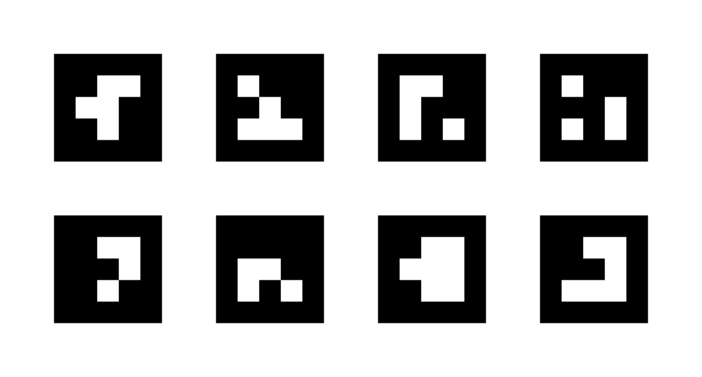
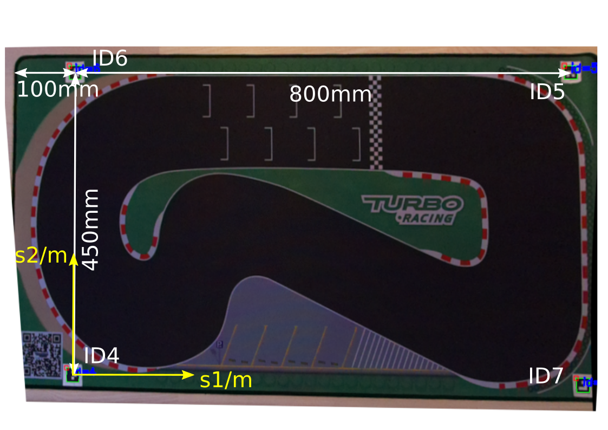

# Markers

## Marker Generation

  - The cars are tracked by ArUco markers.

  - Computer vision computes the cartesian coordinates and the yaw
    angles of the cars.

  - The markers are generated with the OpenCV ArUco library.

  - A custom ArUco dictionary of 8 markers with a size of 3x3 bits is
    used to increase the reliablity of computer vision.

  - TODO: source code

  - The markers IDs are from 0 to 7, 0 to 3 in the first row from left
    to right, and 4 to 7 in the second row.

  - Print the markers on a snow-white, 80 grams paper.
    
      - Make sure to configure high quality printing.
    
      - Scale the printing such that the black area of the markers have
        a height and width of 21 mm each.

  - Cut the markers as squares including approx. 5mm boundaries.

  - Note the marker IDs before cutting with a thin pencil on the
    boundaries, because you will need these IDs later on.

## Frame Markers

  - Four frame markers define the coordinate frame of the track.

  - All coordinates of cars and track are measured in meters.

  - The frame origin \((s_{01},s_{02})=(0\,\mathrm{m},0\,\mathrm{m})\)
    is at the center point of marker ID4.

  - Place frame markers with IDs 4, 5, 6, 7 at corners of board as
    depicted in figure.
    
      - It is recommended to apply the distances as dispicted.
    
      - Although modified distances may be later configured in the ROS2
        package `mbmadvisionaruco`.
    
      - The distances are measured at the marker center points.
    
      - The markers must form a rectangle.
    
      - The sequence of the marker IDs is essential.
